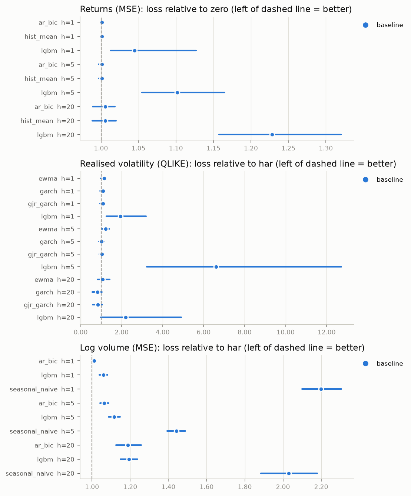
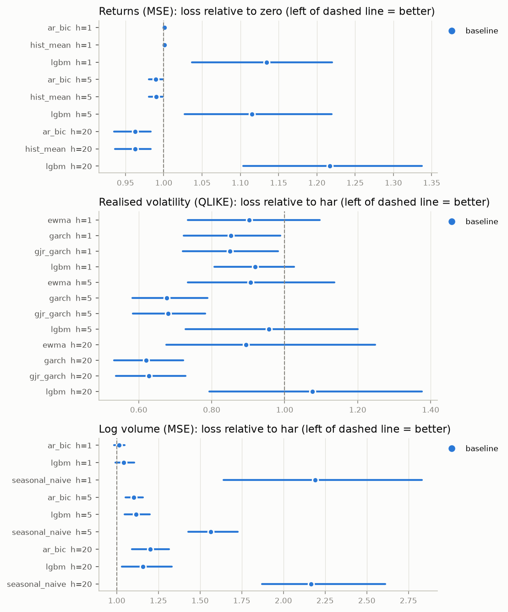
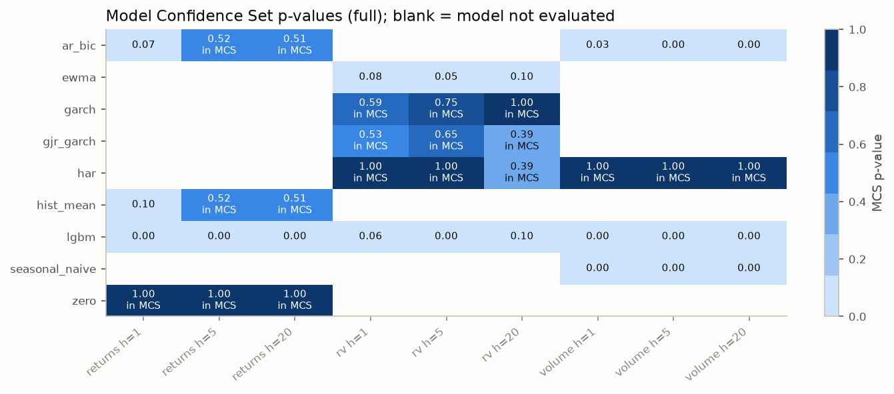
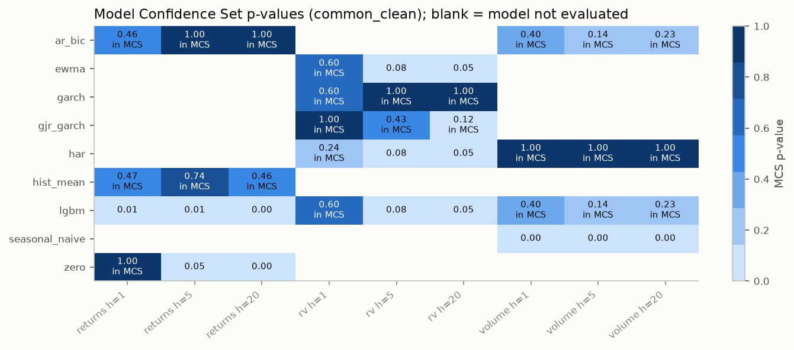
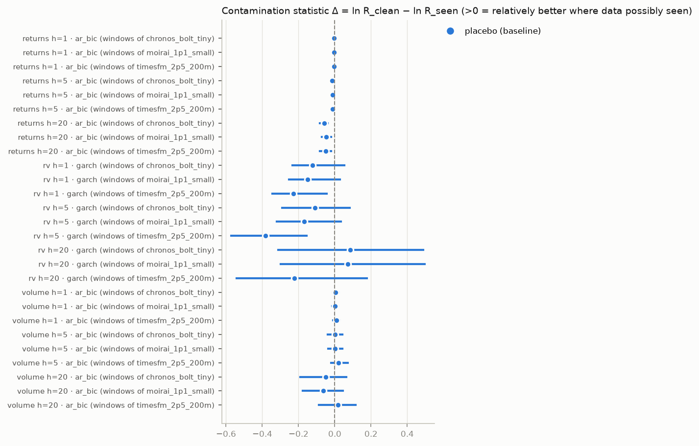
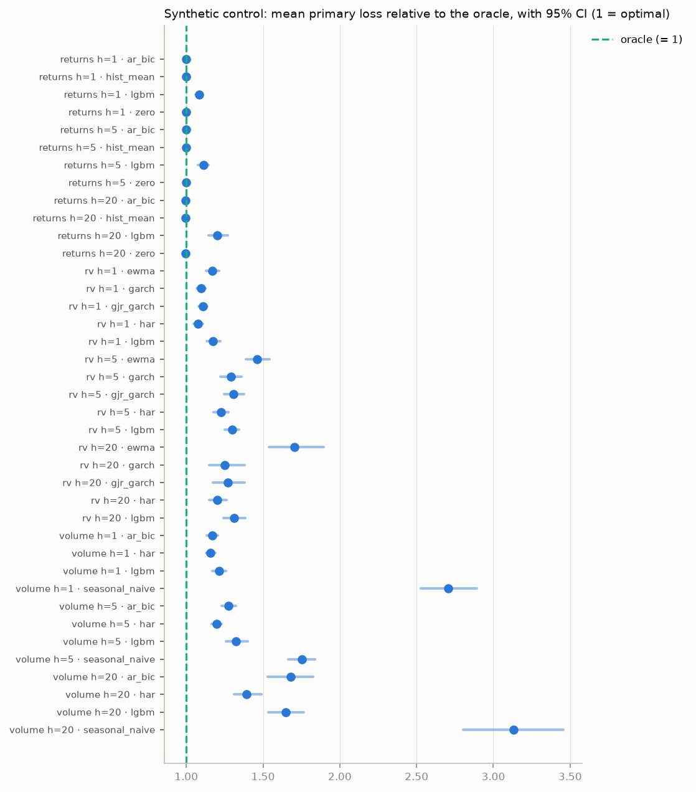

# Results: `default_fixtures`

Generated by `tsfm-rc report` from the artifacts in `results/default_fixtures/`. Nothing in this file is typed by hand: every number is read from a stored table whose SHA-256 is listed under Provenance, and rendering again from the same artifacts gives an identical file.

> **⚠️ SYNTHETIC FIXTURE DATA.** Every number in this report was computed on simulated
> series from `data/fixtures/` (GARCH/HAR processes with known parameters), not on market
> data. It demonstrates that the pipeline runs and is internally consistent; it says
> nothing about real markets or about the foundation models' real skill.

> **UNAVAILABLE models** (no numbers exist for them anywhere in this report):
> - `chronos_bolt_tiny`: could not download 'amazon/chronos-bolt-tiny' from Hugging Face (ProxyError: (MaxRetryError("HTTPSConnectionPool(host='huggingface.co', port=443): Max retries exceeded with url: /api/models/amazon/chronos-bolt-tiny/revis
> - `timesfm_2p5_200m`: could not download 'google/timesfm-2.5-200m-pytorch' from Hugging Face (ProxyError: (MaxRetryError("HTTPSConnectionPool(host='huggingface.co', port=443): Max retries exceeded with url: /api/models/google/timesfm-2.5-200m
> - `moirai_1p1_small`: could not download 'Salesforce/moirai-1.1-R-small' from Hugging Face (ProxyError: (MaxRetryError("HTTPSConnectionPool(host='huggingface.co', port=443): Max retries exceeded with url: /api/models/Salesforce/moirai-1.1-R-s

## 1. Summary in plain English

- **Primary question (TSFMs vs baselines): no answer from this run.** None of the pre-registered foundation models could be evaluated (see the UNAVAILABLE list above). This is an *absent* result, not a null result.
- **Returns (MSE)** (vs `zero`, full test period): no model is Holm-significantly better than the reference; significantly worse: `lgbm` h=1, `lgbm` h=5, `lgbm` h=20.
- **Realised volatility (QLIKE)** (vs `har`, full test period): no model is Holm-significantly better than the reference; significantly worse: `lgbm` h=5.
- **Log volume (MSE)** (vs `har`, full test period): no model is Holm-significantly better than the reference; significantly worse: `lgbm` h=1, `seasonal_naive` h=1, `ar_bic` h=5, `lgbm` h=5, `seasonal_naive` h=5, `ar_bic` h=20, `lgbm` h=20, `seasonal_naive` h=20.
- MCS (α = 0.10, full period) for returns h=1: {`zero`}.
- MCS (α = 0.10, full period) for returns h=5: {`hist_mean`, `ar_bic`, `zero`}.
- MCS (α = 0.10, full period) for returns h=20: {`ar_bic`, `hist_mean`, `zero`}.
- MCS (α = 0.10, full period) for rv h=1: {`gjr_garch`, `garch`, `har`}.
- MCS (α = 0.10, full period) for rv h=5: {`gjr_garch`, `garch`, `har`}.
- MCS (α = 0.10, full period) for rv h=20: {`har`, `gjr_garch`, `garch`}.
- MCS (α = 0.10, full period) for volume h=1: {`har`}.
- MCS (α = 0.10, full period) for volume h=5: {`har`}.
- MCS (α = 0.10, full period) for volume h=20: {`har`}.
- **Synthetic control** (series no model can have seen): closest to the oracle: returns h=20: `hist_mean` (0.996× oracle loss, 95% CI [0.982, 1.011]: below 1 only by sampling noise); returns h=5: `hist_mean` (0.999× oracle loss, 95% CI [0.996, 1.003]: below 1 only by sampling noise); returns h=1: `hist_mean` (1.000× oracle loss, 95% CI [0.998, 1.002]: indistinguishable from the oracle); rv h=1: `har` (1.078× oracle loss, 95% CI [1.049, 1.108]); volume h=1: `har` (1.158× oracle loss, 95% CI [1.128, 1.190]); volume h=5: `har` (1.199× oracle loss, 95% CI [1.166, 1.231]); rv h=20: `har` (1.202× oracle loss, 95% CI [1.148, 1.263]); rv h=5: `har` (1.225× oracle loss, 95% CI [1.179, 1.277]); volume h=20: `har` (1.394× oracle loss, 95% CI [1.312, 1.490]). A ratio below 1 whose CI covers 1 is sampling noise: the oracle is optimal only in expectation.

## 2. Pre-registered primary tests (27)

Each TSFM vs the pre-registered reference baseline (returns: `zero`, rv: `har`, volume: `har`) on **stride-1 origins inside the model's own clean window** (amendment A4), pooled across assets, expanding window, primary loss. Relative loss < 1 means the TSFM is better. Test: Kiefer–Vogelsang fixed-b (Bartlett kernel, bandwidth T) with its own two-sided p-values; Holm over the family. "sim. size" is the worst rejection rate of this test under the null in the A4 simulation at the nearest simulated sample size not above T (nominal 5%; DECISIONS D-039).

| model | target | h | reference | rel. loss [95% CI] | t (KV) | p | Holm p | T | sim. size | verdict |
|---|---|---|---|---|---|---|---|---|---|---|
| chronos_bolt_tiny | returns | 1 | zero | UNAVAILABLE | – | – | – | – | – | – |
| chronos_bolt_tiny | returns | 5 | zero | UNAVAILABLE | – | – | – | – | – | – |
| chronos_bolt_tiny | returns | 20 | zero | UNAVAILABLE | – | – | – | – | – | – |
| chronos_bolt_tiny | rv | 1 | har | UNAVAILABLE | – | – | – | – | – | – |
| chronos_bolt_tiny | rv | 5 | har | UNAVAILABLE | – | – | – | – | – | – |
| chronos_bolt_tiny | rv | 20 | har | UNAVAILABLE | – | – | – | – | – | – |
| chronos_bolt_tiny | volume | 1 | har | UNAVAILABLE | – | – | – | – | – | – |
| chronos_bolt_tiny | volume | 5 | har | UNAVAILABLE | – | – | – | – | – | – |
| chronos_bolt_tiny | volume | 20 | har | UNAVAILABLE | – | – | – | – | – | – |
| timesfm_2p5_200m | returns | 1 | zero | UNAVAILABLE | – | – | – | – | – | – |
| timesfm_2p5_200m | returns | 5 | zero | UNAVAILABLE | – | – | – | – | – | – |
| timesfm_2p5_200m | returns | 20 | zero | UNAVAILABLE | – | – | – | – | – | – |
| timesfm_2p5_200m | rv | 1 | har | UNAVAILABLE | – | – | – | – | – | – |
| timesfm_2p5_200m | rv | 5 | har | UNAVAILABLE | – | – | – | – | – | – |
| timesfm_2p5_200m | rv | 20 | har | UNAVAILABLE | – | – | – | – | – | – |
| timesfm_2p5_200m | volume | 1 | har | UNAVAILABLE | – | – | – | – | – | – |
| timesfm_2p5_200m | volume | 5 | har | UNAVAILABLE | – | – | – | – | – | – |
| timesfm_2p5_200m | volume | 20 | har | UNAVAILABLE | – | – | – | – | – | – |
| moirai_1p1_small | returns | 1 | zero | UNAVAILABLE | – | – | – | – | – | – |
| moirai_1p1_small | returns | 5 | zero | UNAVAILABLE | – | – | – | – | – | – |
| moirai_1p1_small | returns | 20 | zero | UNAVAILABLE | – | – | – | – | – | – |
| moirai_1p1_small | rv | 1 | har | UNAVAILABLE | – | – | – | – | – | – |
| moirai_1p1_small | rv | 5 | har | UNAVAILABLE | – | – | – | – | – | – |
| moirai_1p1_small | rv | 20 | har | UNAVAILABLE | – | – | – | – | – | – |
| moirai_1p1_small | volume | 1 | har | UNAVAILABLE | – | – | – | – | – | – |
| moirai_1p1_small | volume | 5 | har | UNAVAILABLE | – | – | – | – | – | – |
| moirai_1p1_small | volume | 20 | har | UNAVAILABLE | – | – | – | – | – | – |

## 3. Which conclusions survive multiple-testing correction

A conclusion is listed as *surviving* only if its Holm-adjusted p-value is below 0.05 within its pre-specified family. Everything that was significant only before correction is listed separately and should **not** be reported as a finding.

| family | tests | raw p < α | Holm-significant |
|---|---|---|---|
| All models vs reference · common_clean · expanding window | 30 | 17 | 6 |
| All models vs reference · common_clean · rolling window | 30 | 12 | 6 |
| All models vs reference · full · expanding window | 30 | 15 | 12 |
| All models vs reference · full · rolling window | 30 | 19 | 11 |
| Per-asset tests · common_clean | 150 | 31 | 3 |
| Probabilistic h=1 (CRPS) · common_clean | 2 | 0 | 0 |
| Probabilistic h=1 (CRPS) · full | 2 | 1 | 1 |

**Survives correction:**

- All models vs reference · common_clean · expanding window: `garch` vs `har` · rv h=5: model **better** (p = <0.001, Holm p = 0.008)
- All models vs reference · common_clean · expanding window: `gjr_garch` vs `har` · rv h=5: model **better** (p = <0.001, Holm p = 0.012)
- All models vs reference · common_clean · expanding window: `seasonal_naive` vs `har` · volume h=1: model **worse** (p = <0.001, Holm p = <0.001)
- All models vs reference · common_clean · expanding window: `ar_bic` vs `har` · volume h=5: model **worse** (p = <0.001, Holm p = 0.002)
- All models vs reference · common_clean · expanding window: `seasonal_naive` vs `har` · volume h=5: model **worse** (p = <0.001, Holm p = <0.001)
- All models vs reference · common_clean · expanding window: `seasonal_naive` vs `har` · volume h=20: model **worse** (p = <0.001, Holm p = <0.001)
- All models vs reference · common_clean · rolling window: `lgbm` vs `zero` · returns h=20: model **worse** (p = <0.001, Holm p = 0.011)
- All models vs reference · common_clean · rolling window: `lgbm` vs `har` · rv h=20: model **worse** (p = <0.001, Holm p = <0.001)
- All models vs reference · common_clean · rolling window: `seasonal_naive` vs `har` · volume h=1: model **worse** (p = <0.001, Holm p = <0.001)
- All models vs reference · common_clean · rolling window: `lgbm` vs `har` · volume h=5: model **worse** (p = <0.001, Holm p = 0.004)
- All models vs reference · common_clean · rolling window: `seasonal_naive` vs `har` · volume h=5: model **worse** (p = <0.001, Holm p = <0.001)
- All models vs reference · common_clean · rolling window: `seasonal_naive` vs `har` · volume h=20: model **worse** (p = <0.001, Holm p = <0.001)
- All models vs reference · full · expanding window: `lgbm` vs `zero` · returns h=1: model **worse** (p = <0.001, Holm p = <0.001)
- All models vs reference · full · expanding window: `lgbm` vs `zero` · returns h=5: model **worse** (p = <0.001, Holm p = <0.001)
- All models vs reference · full · expanding window: `lgbm` vs `zero` · returns h=20: model **worse** (p = <0.001, Holm p = <0.001)
- All models vs reference · full · expanding window: `lgbm` vs `har` · rv h=5: model **worse** (p = 0.001, Holm p = 0.023)
- All models vs reference · full · expanding window: `lgbm` vs `har` · volume h=1: model **worse** (p = <0.001, Holm p = <0.001)
- All models vs reference · full · expanding window: `seasonal_naive` vs `har` · volume h=1: model **worse** (p = <0.001, Holm p = <0.001)
- All models vs reference · full · expanding window: `ar_bic` vs `har` · volume h=5: model **worse** (p = <0.001, Holm p = <0.001)
- All models vs reference · full · expanding window: `lgbm` vs `har` · volume h=5: model **worse** (p = <0.001, Holm p = <0.001)
- All models vs reference · full · expanding window: `seasonal_naive` vs `har` · volume h=5: model **worse** (p = <0.001, Holm p = <0.001)
- All models vs reference · full · expanding window: `ar_bic` vs `har` · volume h=20: model **worse** (p = <0.001, Holm p = <0.001)
- All models vs reference · full · expanding window: `lgbm` vs `har` · volume h=20: model **worse** (p = <0.001, Holm p = <0.001)
- All models vs reference · full · expanding window: `seasonal_naive` vs `har` · volume h=20: model **worse** (p = <0.001, Holm p = <0.001)
- All models vs reference · full · rolling window: `lgbm` vs `zero` · returns h=1: model **worse** (p = <0.001, Holm p = <0.001)
- All models vs reference · full · rolling window: `lgbm` vs `zero` · returns h=5: model **worse** (p = <0.001, Holm p = <0.001)
- All models vs reference · full · rolling window: `lgbm` vs `zero` · returns h=20: model **worse** (p = <0.001, Holm p = <0.001)
- All models vs reference · full · rolling window: `lgbm` vs `har` · volume h=1: model **worse** (p = <0.001, Holm p = <0.001)
- All models vs reference · full · rolling window: `seasonal_naive` vs `har` · volume h=1: model **worse** (p = <0.001, Holm p = <0.001)
- All models vs reference · full · rolling window: `ar_bic` vs `har` · volume h=5: model **worse** (p = <0.001, Holm p = <0.001)
- All models vs reference · full · rolling window: `lgbm` vs `har` · volume h=5: model **worse** (p = <0.001, Holm p = <0.001)
- All models vs reference · full · rolling window: `seasonal_naive` vs `har` · volume h=5: model **worse** (p = <0.001, Holm p = <0.001)
- All models vs reference · full · rolling window: `ar_bic` vs `har` · volume h=20: model **worse** (p = <0.001, Holm p = <0.001)
- All models vs reference · full · rolling window: `lgbm` vs `har` · volume h=20: model **worse** (p = <0.001, Holm p = <0.001)
- All models vs reference · full · rolling window: `seasonal_naive` vs `har` · volume h=20: model **worse** (p = <0.001, Holm p = <0.001)
- Per-asset tests · common_clean: `seasonal_naive` vs `har` · volume h=1 · SYN_QUIRKS: model **worse** (p = <0.001, Holm p = 0.029)
- Per-asset tests · common_clean: `seasonal_naive` vs `har` · volume h=5 · SYN_GARCH_B: model **worse** (p = <0.001, Holm p = 0.025)
- Per-asset tests · common_clean: `seasonal_naive` vs `har` · volume h=20 · SYN_GARCH_B: model **worse** (p = <0.001, Holm p = 0.003)
- Probabilistic h=1 (CRPS) · full: `ar_bic` vs `hist_mean` · returns h=1: model **worse** (p = <0.001, Holm p = <0.001)

**Significant before correction only (do not report as findings):**

- All models vs reference · common_clean · expanding window: `lgbm` vs `zero` · returns h=1: worse at raw p = 0.019, but Holm p = 0.354
- All models vs reference · common_clean · expanding window: `ar_bic` vs `zero` · returns h=5: better at raw p = 0.031, but Holm p = 0.493
- All models vs reference · common_clean · expanding window: `hist_mean` vs `zero` · returns h=5: better at raw p = 0.031, but Holm p = 0.493
- All models vs reference · common_clean · expanding window: `lgbm` vs `zero` · returns h=5: worse at raw p = 0.024, but Holm p = 0.409
- All models vs reference · common_clean · expanding window: `ar_bic` vs `zero` · returns h=20: better at raw p = 0.013, but Holm p = 0.263
- All models vs reference · common_clean · expanding window: `hist_mean` vs `zero` · returns h=20: better at raw p = 0.013, but Holm p = 0.268
- All models vs reference · common_clean · expanding window: `lgbm` vs `zero` · returns h=20: worse at raw p = 0.048, but Holm p = 0.676
- All models vs reference · common_clean · expanding window: `garch` vs `har` · rv h=20: better at raw p = 0.002, but Holm p = 0.057
- All models vs reference · common_clean · expanding window: `gjr_garch` vs `har` · rv h=20: better at raw p = 0.003, but Holm p = 0.074
- All models vs reference · common_clean · expanding window: `lgbm` vs `har` · volume h=5: worse at raw p = 0.009, but Holm p = 0.200
- All models vs reference · common_clean · expanding window: `ar_bic` vs `har` · volume h=20: worse at raw p = 0.021, but Holm p = 0.380
- All models vs reference · common_clean · rolling window: `lgbm` vs `zero` · returns h=1: worse at raw p = 0.004, but Holm p = 0.082
- All models vs reference · common_clean · rolling window: `lgbm` vs `zero` · returns h=5: worse at raw p = 0.047, but Holm p = 0.894
- All models vs reference · common_clean · rolling window: `lgbm` vs `har` · rv h=5: worse at raw p = 0.009, but Holm p = 0.180
- All models vs reference · common_clean · rolling window: `ar_bic` vs `har` · volume h=5: worse at raw p = 0.003, but Holm p = 0.080
- All models vs reference · common_clean · rolling window: `ar_bic` vs `har` · volume h=20: worse at raw p = 0.031, but Holm p = 0.626
- All models vs reference · common_clean · rolling window: `lgbm` vs `har` · volume h=20: worse at raw p = 0.006, but Holm p = 0.137
- All models vs reference · full · expanding window: `lgbm` vs `har` · rv h=1: worse at raw p = 0.022, but Holm p = 0.392
- All models vs reference · full · expanding window: `ewma` vs `har` · rv h=5: worse at raw p = 0.040, but Holm p = 0.641
- All models vs reference · full · expanding window: `ar_bic` vs `har` · volume h=1: worse at raw p = 0.032, but Holm p = 0.536
- All models vs reference · full · rolling window: `ar_bic` vs `zero` · returns h=5: worse at raw p = 0.041, but Holm p = 0.656
- All models vs reference · full · rolling window: `hist_mean` vs `zero` · returns h=5: worse at raw p = 0.041, but Holm p = 0.656
- All models vs reference · full · rolling window: `ar_bic` vs `zero` · returns h=20: worse at raw p = 0.044, but Holm p = 0.656
- All models vs reference · full · rolling window: `hist_mean` vs `zero` · returns h=20: worse at raw p = 0.048, but Holm p = 0.656
- All models vs reference · full · rolling window: `lgbm` vs `har` · rv h=1: worse at raw p = 0.041, but Holm p = 0.656
- All models vs reference · full · rolling window: `ewma` vs `har` · rv h=5: worse at raw p = 0.005, but Holm p = 0.083
- All models vs reference · full · rolling window: `lgbm` vs `har` · rv h=5: worse at raw p = 0.038, but Holm p = 0.640
- All models vs reference · full · rolling window: `ar_bic` vs `har` · volume h=1: worse at raw p = 0.003, but Holm p = 0.060
- Per-asset tests · common_clean: `ar_bic` vs `zero` · returns h=1 · SYN_HAR_B: worse at raw p = 0.037, but Holm p = 1.000
- Per-asset tests · common_clean: `hist_mean` vs `zero` · returns h=1 · SYN_HAR_B: worse at raw p = 0.037, but Holm p = 1.000
- Per-asset tests · common_clean: `lgbm` vs `zero` · returns h=1 · SYN_HAR_B: worse at raw p = 0.012, but Holm p = 1.000
- Per-asset tests · common_clean: `lgbm` vs `zero` · returns h=20 · SYN_HAR_A: worse at raw p = 0.014, but Holm p = 1.000
- Per-asset tests · common_clean: `lgbm` vs `har` · rv h=1 · SYN_HAR_A: worse at raw p = 0.043, but Holm p = 1.000
- Per-asset tests · common_clean: `lgbm` vs `har` · rv h=1 · SYN_HAR_B: worse at raw p = 0.047, but Holm p = 1.000
- Per-asset tests · common_clean: `garch` vs `har` · rv h=5 · SYN_GARCH_A: better at raw p = 0.003, but Holm p = 0.400
- Per-asset tests · common_clean: `garch` vs `har` · rv h=5 · SYN_GARCH_B: better at raw p = 0.045, but Holm p = 1.000
- Per-asset tests · common_clean: `garch` vs `har` · rv h=5 · SYN_QUIRKS: better at raw p = 0.045, but Holm p = 1.000
- Per-asset tests · common_clean: `gjr_garch` vs `har` · rv h=5 · SYN_GARCH_A: better at raw p = 0.003, but Holm p = 0.464
- Per-asset tests · common_clean: `gjr_garch` vs `har` · rv h=5 · SYN_GARCH_B: better at raw p = 0.045, but Holm p = 1.000
- Per-asset tests · common_clean: `gjr_garch` vs `har` · rv h=5 · SYN_QUIRKS: better at raw p = 0.045, but Holm p = 1.000
- … and 16 more.

**Contamination tests surviving Holm and exceeding the placebo:** 0.

## 4. All models vs reference (secondary)

Pooled relative loss with 95% stationary-bootstrap CI. `full` = whole test period (possibly contaminated for TSFMs); `common_clean` = after the latest TSFM release + 30 days.

### full · expanding window

| target | h | model | reference | loss | rel. loss [95% CI] | DM | p | Holm p | T | flags |
|---|---|---|---|---|---|---|---|---|---|---|
| returns | 1 | ar_bic | zero | MSE | 1.001 [1.000, 1.002] | 1.55 | 0.121 | 1.000 | 576 |  |
| returns | 1 | hist_mean | zero | MSE | 1.001 [1.000, 1.002] | 1.45 | 0.148 | 1.000 | 576 |  |
| returns | 1 | lgbm | zero | MSE | 1.045 [1.012, 1.127] | 4.66 | <0.001 | <0.001 | 576 |  |
| returns | 5 | ar_bic | zero | MSE | 1.001 [0.997, 1.005] | 0.69 | 0.492 | 1.000 | 575 |  |
| returns | 5 | hist_mean | zero | MSE | 1.001 [0.997, 1.005] | 0.69 | 0.491 | 1.000 | 575 |  |
| returns | 5 | lgbm | zero | MSE | 1.102 [1.055, 1.165] | 6.30 | <0.001 | <0.001 | 575 |  |
| returns | 20 | ar_bic | zero | MSE | 1.006 [0.989, 1.019] | 0.70 | 0.486 | 1.000 | 572 |  |
| returns | 20 | hist_mean | zero | MSE | 1.006 [0.988, 1.020] | 0.69 | 0.489 | 1.000 | 572 |  |
| returns | 20 | lgbm | zero | MSE | 1.228 [1.158, 1.321] | 7.95 | <0.001 | <0.001 | 572 |  |
| rv | 1 | ewma | har | QLIKE | 1.146 [0.989, 1.246] | 1.25 | 0.211 | 1.000 | 576 |  |
| rv | 1 | garch | har | QLIKE | 1.087 [0.940, 1.185] | 0.82 | 0.411 | 1.000 | 576 |  |
| rv | 1 | gjr_garch | har | QLIKE | 1.097 [0.947, 1.200] | 0.87 | 0.387 | 1.000 | 576 |  |
| rv | 1 | lgbm | har | QLIKE | 1.937 [1.251, 3.184] | 2.30 | 0.022 | 0.392 | 576 |  |
| rv | 5 | ewma | har | QLIKE | 1.216 [1.039, 1.396] | 2.06 | 0.040 | 0.641 | 575 |  |
| rv | 5 | garch | har | QLIKE | 1.024 [0.893, 1.145] | 0.32 | 0.747 | 1.000 | 575 |  |
| rv | 5 | gjr_garch | har | QLIKE | 1.035 [0.908, 1.149] | 0.45 | 0.650 | 1.000 | 575 |  |
| rv | 5 | lgbm | har | QLIKE | 6.603 [3.222, 12.720] | 3.25 | 0.001 | 0.023 | 575 |  |
| rv | 20 | ewma | har | QLIKE | 1.081 [0.828, 1.420] | 0.50 | 0.617 | 1.000 | 572 |  |
| rv | 20 | garch | har | QLIKE | 0.815 [0.570, 1.045] | -0.96 | 0.339 | 1.000 | 572 |  |
| rv | 20 | gjr_garch | har | QLIKE | 0.830 [0.579, 1.062] | -0.87 | 0.383 | 1.000 | 572 |  |
| rv | 20 | lgbm | har | QLIKE | 2.196 [0.975, 4.905] | 1.92 | 0.055 | 0.831 | 572 |  |
| volume | 1 | ar_bic | har | MSE | 1.012 [1.002, 1.022] | 2.16 | 0.032 | 0.536 | 576 |  |
| volume | 1 | lgbm | har | MSE | 1.060 [1.039, 1.081] | 5.74 | <0.001 | <0.001 | 576 |  |
| volume | 1 | seasonal_naive | har | MSE | 2.198 [2.100, 2.306] | 23.09 | <0.001 | <0.001 | 576 |  |
| volume | 5 | ar_bic | har | MSE | 1.064 [1.043, 1.087] | 5.90 | <0.001 | <0.001 | 575 |  |
| volume | 5 | lgbm | har | MSE | 1.117 [1.087, 1.148] | 8.10 | <0.001 | <0.001 | 575 |  |
| volume | 5 | seasonal_naive | har | MSE | 1.441 [1.394, 1.488] | 18.52 | <0.001 | <0.001 | 575 |  |
| volume | 20 | ar_bic | har | MSE | 1.188 [1.125, 1.257] | 5.25 | <0.001 | <0.001 | 572 |  |
| volume | 20 | lgbm | har | MSE | 1.193 [1.148, 1.237] | 7.95 | <0.001 | <0.001 | 572 |  |
| volume | 20 | seasonal_naive | har | MSE | 2.030 [1.885, 2.179] | 21.15 | <0.001 | <0.001 | 572 |  |

### common_clean · expanding window

| target | h | model | reference | loss | rel. loss [95% CI] | DM | p | Holm p | T | flags |
|---|---|---|---|---|---|---|---|---|---|---|
| returns | 1 | ar_bic | zero | MSE | 1.001 [0.998, 1.005] | 0.67 | 0.505 | 1.000 | 35 | small_sample |
| returns | 1 | hist_mean | zero | MSE | 1.001 [0.998, 1.005] | 0.66 | 0.515 | 1.000 | 35 | small_sample |
| returns | 1 | lgbm | zero | MSE | 1.134 [1.037, 1.220] | 2.47 | 0.019 | 0.354 | 35 | small_sample |
| returns | 5 | ar_bic | zero | MSE | 0.990 [0.980, 0.998] | -2.26 | 0.031 | 0.493 | 34 | small_sample |
| returns | 5 | hist_mean | zero | MSE | 0.990 [0.981, 0.999] | -2.25 | 0.031 | 0.493 | 34 | small_sample |
| returns | 5 | lgbm | zero | MSE | 1.116 [1.027, 1.219] | 2.36 | 0.024 | 0.409 | 34 | small_sample |
| returns | 20 | ar_bic | zero | MSE | 0.962 [0.935, 0.983] | -2.66 | 0.013 | 0.263 | 31 | small_sample |
| returns | 20 | hist_mean | zero | MSE | 0.963 [0.936, 0.983] | -2.63 | 0.013 | 0.268 | 31 | small_sample |
| returns | 20 | lgbm | zero | MSE | 1.217 [1.104, 1.337] | 2.06 | 0.048 | 0.676 | 31 | small_sample |
| rv | 1 | ewma | har | QLIKE | 0.902 [0.735, 1.096] | -0.95 | 0.349 | 1.000 | 35 | small_sample |
| rv | 1 | garch | har | QLIKE | 0.853 [0.723, 0.988] | -1.77 | 0.086 | 1.000 | 35 | small_sample |
| rv | 1 | gjr_garch | har | QLIKE | 0.850 [0.720, 0.982] | -1.78 | 0.084 | 1.000 | 35 | small_sample |
| rv | 1 | lgbm | har | QLIKE | 0.918 [0.807, 1.026] | -1.23 | 0.227 | 1.000 | 35 | small_sample |
| rv | 5 | ewma | har | QLIKE | 0.907 [0.735, 1.137] | -0.89 | 0.380 | 1.000 | 34 | small_sample |
| rv | 5 | garch | har | QLIKE | 0.677 [0.583, 0.789] | -4.04 | <0.001 | 0.008 | 34 | small_sample |
| rv | 5 | gjr_garch | har | QLIKE | 0.681 [0.584, 0.782] | -3.89 | <0.001 | 0.012 | 34 | small_sample |
| rv | 5 | lgbm | har | QLIKE | 0.957 [0.729, 1.200] | -0.34 | 0.736 | 1.000 | 34 | small_sample |
| rv | 20 | ewma | har | QLIKE | 0.894 [0.675, 1.248] | -0.55 | 0.584 | 1.000 | 31 | small_sample |
| rv | 20 | garch | har | QLIKE | 0.620 [0.533, 0.722] | -3.32 | 0.002 | 0.057 | 31 | small_sample |
| rv | 20 | gjr_garch | har | QLIKE | 0.628 [0.537, 0.729] | -3.20 | 0.003 | 0.074 | 31 | small_sample |
| rv | 20 | lgbm | har | QLIKE | 1.076 [0.793, 1.376] | 0.39 | 0.703 | 1.000 | 31 | small_sample |
| volume | 1 | ar_bic | har | MSE | 1.014 [0.985, 1.047] | 0.93 | 0.356 | 1.000 | 35 | small_sample |
| volume | 1 | lgbm | har | MSE | 1.041 [0.991, 1.104] | 1.32 | 0.197 | 1.000 | 35 | small_sample |
| volume | 1 | seasonal_naive | har | MSE | 2.190 [1.642, 2.831] | 4.82 | <0.001 | <0.001 | 35 | small_sample |
| volume | 5 | ar_bic | har | MSE | 1.102 [1.052, 1.157] | 4.46 | <0.001 | 0.002 | 34 | small_sample |
| volume | 5 | lgbm | har | MSE | 1.117 [1.049, 1.198] | 2.77 | 0.009 | 0.200 | 34 | small_sample |
| volume | 5 | seasonal_naive | har | MSE | 1.565 [1.428, 1.726] | 8.19 | <0.001 | <0.001 | 34 | small_sample |
| volume | 20 | ar_bic | har | MSE | 1.201 [1.092, 1.313] | 2.43 | 0.021 | 0.380 | 31 | small_sample |
| volume | 20 | lgbm | har | MSE | 1.156 [1.031, 1.330] | 1.96 | 0.060 | 0.776 | 31 | small_sample |
| volume | 20 | seasonal_naive | har | MSE | 2.167 [1.871, 2.610] | 6.95 | <0.001 | <0.001 | 31 | small_sample |

## 5. Robustness: rolling vs expanding window (baselines)

30 model/target/horizon comparisons exist in both variants; in **1** the direction (relative loss above/below 1) or Holm significance differs between the expanding and the rolling window.

| target | h | model | rel. loss (expanding) | Holm sig. | rel. loss (rolling) | Holm sig. |
|---|---|---|---|---|---|---|
| rv | 5 | lgbm | 6.603 | True | 4.517 | False |

## 6. Model Confidence Sets

Hansen–Lunde–Nason MCS, T_max statistic, α = 0.10, stationary bootstrap (B = 1000), pooled normalised primary loss on (asset, origin) pairs where every model has a forecast.

| period | target | h | model | mean norm. loss | MCS p | in MCS | T |
|---|---|---|---|---|---|---|---|
| common_clean | returns | 1 | zero | 1.160 | 1.000 | yes | 35 |
| common_clean | returns | 1 | hist_mean | 1.161 | 0.467 | yes | 35 |
| common_clean | returns | 1 | ar_bic | 1.161 | 0.463 | yes | 35 |
| common_clean | returns | 1 | lgbm | 1.315 | 0.013 | no | 35 |
| common_clean | returns | 5 | ar_bic | 1.190 | 1.000 | yes | 34 |
| common_clean | returns | 5 | hist_mean | 1.190 | 0.736 | yes | 34 |
| common_clean | returns | 5 | zero | 1.202 | 0.048 | no | 34 |
| common_clean | returns | 5 | lgbm | 1.341 | 0.008 | no | 34 |
| common_clean | returns | 20 | ar_bic | 1.394 | 1.000 | yes | 31 |
| common_clean | returns | 20 | hist_mean | 1.394 | 0.464 | yes | 31 |
| common_clean | returns | 20 | lgbm | 1.762 | <0.001 | no | 31 |
| common_clean | returns | 20 | zero | 1.448 | <0.001 | no | 31 |
| common_clean | rv | 1 | gjr_garch | 0.190 | 1.000 | yes | 35 |
| common_clean | rv | 1 | lgbm | 0.205 | 0.602 | yes | 35 |
| common_clean | rv | 1 | ewma | 0.201 | 0.602 | yes | 35 |
| common_clean | rv | 1 | garch | 0.190 | 0.602 | yes | 35 |
| common_clean | rv | 1 | har | 0.223 | 0.238 | yes | 35 |
| common_clean | rv | 5 | garch | 0.066 | 1.000 | yes | 34 |
| common_clean | rv | 5 | gjr_garch | 0.067 | 0.435 | yes | 34 |
| common_clean | rv | 5 | har | 0.098 | 0.082 | no | 34 |
| common_clean | rv | 5 | lgbm | 0.094 | 0.082 | no | 34 |
| common_clean | rv | 5 | ewma | 0.089 | 0.082 | no | 34 |
| common_clean | rv | 20 | garch | 0.045 | 1.000 | yes | 31 |
| common_clean | rv | 20 | gjr_garch | 0.046 | 0.118 | yes | 31 |
| common_clean | rv | 20 | lgbm | 0.078 | 0.053 | no | 31 |
| common_clean | rv | 20 | har | 0.073 | 0.053 | no | 31 |
| common_clean | rv | 20 | ewma | 0.065 | 0.053 | no | 31 |
| common_clean | volume | 1 | har | 0.763 | 1.000 | yes | 35 |
| common_clean | volume | 1 | lgbm | 0.794 | 0.399 | yes | 35 |
| common_clean | volume | 1 | ar_bic | 0.774 | 0.399 | yes | 35 |
| common_clean | volume | 1 | seasonal_naive | 1.671 | <0.001 | no | 35 |
| common_clean | volume | 5 | har | 0.745 | 1.000 | yes | 34 |
| common_clean | volume | 5 | lgbm | 0.832 | 0.143 | yes | 34 |
| common_clean | volume | 5 | ar_bic | 0.821 | 0.143 | yes | 34 |
| common_clean | volume | 5 | seasonal_naive | 1.166 | <0.001 | no | 34 |
| common_clean | volume | 20 | har | 0.614 | 1.000 | yes | 31 |
| common_clean | volume | 20 | ar_bic | 0.737 | 0.234 | yes | 31 |
| common_clean | volume | 20 | lgbm | 0.710 | 0.234 | yes | 31 |
| common_clean | volume | 20 | seasonal_naive | 1.330 | <0.001 | no | 31 |
| full | returns | 1 | zero | 2.240 | 1.000 | yes | 576 |
| full | returns | 1 | hist_mean | 2.242 | 0.099 | no | 576 |
| full | returns | 1 | ar_bic | 2.242 | 0.073 | no | 576 |
| full | returns | 1 | lgbm | 2.340 | 0.001 | no | 576 |
| full | returns | 5 | zero | 1.344 | 1.000 | yes | 575 |
| full | returns | 5 | hist_mean | 1.346 | 0.523 | yes | 575 |
| full | returns | 5 | ar_bic | 1.346 | 0.523 | yes | 575 |
| full | returns | 5 | lgbm | 1.480 | <0.001 | no | 575 |
| full | returns | 20 | zero | 1.464 | 1.000 | yes | 572 |
| full | returns | 20 | ar_bic | 1.472 | 0.508 | yes | 572 |
| full | returns | 20 | hist_mean | 1.472 | 0.508 | yes | 572 |
| full | returns | 20 | lgbm | 1.798 | <0.001 | no | 572 |
| full | rv | 1 | har | 0.370 | 1.000 | yes | 576 |
| full | rv | 1 | garch | 0.402 | 0.592 | yes | 576 |
| full | rv | 1 | gjr_garch | 0.406 | 0.530 | yes | 576 |
| full | rv | 1 | ewma | 0.424 | 0.080 | no | 576 |
| full | rv | 1 | lgbm | 0.716 | 0.059 | no | 576 |
| full | rv | 5 | har | 0.122 | 1.000 | yes | 575 |
| full | rv | 5 | garch | 0.124 | 0.753 | yes | 575 |
| full | rv | 5 | gjr_garch | 0.126 | 0.650 | yes | 575 |
| full | rv | 5 | ewma | 0.148 | 0.048 | no | 575 |
| full | rv | 5 | lgbm | 0.803 | 0.003 | no | 575 |
| full | rv | 20 | garch | 0.105 | 1.000 | yes | 572 |
| full | rv | 20 | har | 0.128 | 0.392 | yes | 572 |
| full | rv | 20 | gjr_garch | 0.107 | 0.392 | yes | 572 |
| full | rv | 20 | lgbm | 0.282 | 0.099 | no | 572 |
| full | rv | 20 | ewma | 0.139 | 0.099 | no | 572 |
| full | volume | 1 | har | 0.715 | 1.000 | yes | 576 |
| full | volume | 1 | ar_bic | 0.723 | 0.027 | no | 576 |
| full | volume | 1 | seasonal_naive | 1.571 | <0.001 | no | 576 |
| full | volume | 1 | lgbm | 0.758 | <0.001 | no | 576 |
| full | volume | 5 | har | 0.709 | 1.000 | yes | 575 |
| full | volume | 5 | seasonal_naive | 1.022 | <0.001 | no | 575 |
| full | volume | 5 | lgbm | 0.792 | <0.001 | no | 575 |
| full | volume | 5 | ar_bic | 0.755 | <0.001 | no | 575 |
| full | volume | 20 | har | 0.758 | 1.000 | yes | 572 |
| full | volume | 20 | seasonal_naive | 1.538 | <0.001 | no | 572 |
| full | volume | 20 | lgbm | 0.904 | <0.001 | no | 572 |
| full | volume | 20 | ar_bic | 0.901 | <0.001 | no | 572 |

## 7. Probabilistic forecasts (h = 1)

CRPS approximated from the nine deciles (DECISIONS D-012), normalised by the pre-test standard deviation, and raw pinball losses at τ = 0.1, 0.5, 0.9 (target units); reference: returns → `hist_mean`, rv → `har`, volume → `har`.

| period | target | model | mean CRPS (norm.) | pinball τ=0.1 | pinball τ=0.5 | pinball τ=0.9 | p vs ref (CRPS) | Holm p |
|---|---|---|---|---|---|---|---|---|
| common_clean | returns | ar_bic | 0.622 | 0.243 | 0.483 | 0.246 | 0.540 | 1.000 |
| common_clean | returns | hist_mean | 0.624 | 0.253 | 0.482 | 0.244 | – | – |
| common_clean | rv | har | 0.426 | 0.106 | 0.361 | 0.263 | – | – |
| common_clean | volume | har | 0.539 | 0.051 | 0.111 | 0.050 | – | – |
| common_clean | volume | ar_bic | 0.541 | 0.052 | 0.111 | 0.049 | 0.531 | 1.000 |
| full | returns | hist_mean | 0.647 | 0.259 | 0.517 | 0.238 | – | – |
| full | returns | ar_bic | 0.652 | 0.263 | 0.517 | 0.242 | <0.001 | <0.001 |
| full | rv | har | 0.616 | 0.139 | 0.479 | 0.384 | – | – |
| full | volume | har | 0.521 | 0.048 | 0.108 | 0.048 | – | – |
| full | volume | ar_bic | 0.524 | 0.048 | 0.109 | 0.049 | 0.060 | 0.060 |

## 8. Contamination control

Δ = ln R_clean − ln R_seen with R = (TSFM loss)/(reference loss); Δ > 0 would be consistent with memorisation. Placebo rows apply the same statistic to baselines that cannot memorise, on the same windows, to show how much market-regime differences alone move Δ. The seen side uses the main stride-5 origins; the clean side uses the stride-1 origins of the primary pass (amendment A4), each resampled with a block length set by its own overlap.

| model | release_date | weights_date | effective_release | clean_start | common_clean_start |
|---|---|---|---|---|---|
| chronos_bolt_tiny | 2024-11-26 | None | 2024-11-26 | 2024-12-26 | 2025-10-15 |
| timesfm_2p5_200m | 2025-09-15 | None | 2025-09-15 | 2025-10-15 | 2025-10-15 |
| moirai_1p1_small | 2024-06-30 | None | 2024-06-30 | 2024-07-30 | 2025-10-15 |

| windows of | role | model | target | h | Δ | 95% CI | p (Δ>0) | Holm p | T seen/clean |
|---|---|---|---|---|---|---|---|---|---|
| chronos_bolt_tiny | placebo | ar_bic | returns | 1 | -0.004 | [-0.006, -0.002] | 0.999 | – | 496/377 |
| chronos_bolt_tiny | tsfm | chronos_bolt_tiny | returns | 1 | UNAVAILABLE | – | – | – | – |
| chronos_bolt_tiny | placebo | ar_bic | returns | 5 | -0.015 | [-0.022, -0.007] | 1.000 | – | 496/373 |
| chronos_bolt_tiny | tsfm | chronos_bolt_tiny | returns | 5 | UNAVAILABLE | – | – | – | – |
| chronos_bolt_tiny | placebo | ar_bic | returns | 20 | -0.059 | [-0.081, -0.038] | 1.000 | – | 493/358 |
| chronos_bolt_tiny | tsfm | chronos_bolt_tiny | returns | 20 | UNAVAILABLE | – | – | – | – |
| chronos_bolt_tiny | placebo | garch | rv | 1 | -0.122 | [-0.233, 0.054] | 0.798 | – | 496/377 |
| chronos_bolt_tiny | tsfm | chronos_bolt_tiny | rv | 1 | UNAVAILABLE | – | – | – | – |
| chronos_bolt_tiny | placebo | garch | rv | 5 | -0.110 | [-0.292, 0.084] | 0.834 | – | 496/373 |
| chronos_bolt_tiny | tsfm | chronos_bolt_tiny | rv | 5 | UNAVAILABLE | – | – | – | – |
| chronos_bolt_tiny | placebo | garch | rv | 20 | 0.084 | [-0.312, 0.487] | 0.408 | – | 493/358 |
| chronos_bolt_tiny | tsfm | chronos_bolt_tiny | rv | 20 | UNAVAILABLE | – | – | – | – |
| chronos_bolt_tiny | placebo | ar_bic | volume | 1 | 0.005 | [-0.010, 0.020] | 0.296 | – | 496/377 |
| chronos_bolt_tiny | tsfm | chronos_bolt_tiny | volume | 1 | UNAVAILABLE | – | – | – | – |
| chronos_bolt_tiny | placebo | ar_bic | volume | 5 | 0.003 | [-0.038, 0.043] | 0.477 | – | 496/373 |
| chronos_bolt_tiny | tsfm | chronos_bolt_tiny | volume | 5 | UNAVAILABLE | – | – | – | – |
| chronos_bolt_tiny | placebo | ar_bic | volume | 20 | -0.050 | [-0.190, 0.063] | 0.800 | – | 493/358 |
| chronos_bolt_tiny | tsfm | chronos_bolt_tiny | volume | 20 | UNAVAILABLE | – | – | – | – |
| moirai_1p1_small | placebo | ar_bic | returns | 1 | -0.003 | [-0.005, -0.001] | 1.000 | – | 476/479 |
| moirai_1p1_small | tsfm | moirai_1p1_small | returns | 1 | UNAVAILABLE | – | – | – | – |
| moirai_1p1_small | placebo | ar_bic | returns | 5 | -0.012 | [-0.020, -0.004] | 0.998 | – | 475/475 |
| moirai_1p1_small | tsfm | moirai_1p1_small | returns | 5 | UNAVAILABLE | – | – | – | – |
| moirai_1p1_small | placebo | ar_bic | returns | 20 | -0.046 | [-0.070, -0.019] | 0.999 | – | 472/460 |
| moirai_1p1_small | tsfm | moirai_1p1_small | returns | 20 | UNAVAILABLE | – | – | – | – |
| moirai_1p1_small | placebo | garch | rv | 1 | -0.150 | [-0.254, 0.028] | 0.903 | – | 476/479 |
| moirai_1p1_small | tsfm | moirai_1p1_small | rv | 1 | UNAVAILABLE | – | – | – | – |
| moirai_1p1_small | placebo | garch | rv | 5 | -0.170 | [-0.319, 0.035] | 0.949 | – | 475/475 |
| moirai_1p1_small | tsfm | moirai_1p1_small | rv | 5 | UNAVAILABLE | – | – | – | – |
| moirai_1p1_small | placebo | garch | rv | 20 | 0.073 | [-0.299, 0.497] | 0.488 | – | 472/460 |
| moirai_1p1_small | tsfm | moirai_1p1_small | rv | 20 | UNAVAILABLE | – | – | – | – |
| moirai_1p1_small | placebo | ar_bic | volume | 1 | 0.002 | [-0.013, 0.018] | 0.370 | – | 476/479 |
| moirai_1p1_small | tsfm | moirai_1p1_small | volume | 1 | UNAVAILABLE | – | – | – | – |
| moirai_1p1_small | placebo | ar_bic | volume | 5 | 0.002 | [-0.035, 0.043] | 0.474 | – | 475/475 |
| moirai_1p1_small | tsfm | moirai_1p1_small | volume | 5 | UNAVAILABLE | – | – | – | – |
| moirai_1p1_small | placebo | ar_bic | volume | 20 | -0.064 | [-0.177, 0.044] | 0.883 | – | 472/460 |
| moirai_1p1_small | tsfm | moirai_1p1_small | volume | 20 | UNAVAILABLE | – | – | – | – |
| timesfm_2p5_200m | placebo | ar_bic | returns | 1 | -0.004 | [-0.006, -0.001] | 0.996 | – | 536/176 |
| timesfm_2p5_200m | tsfm | timesfm_2p5_200m | returns | 1 | UNAVAILABLE | – | – | – | – |
| timesfm_2p5_200m | placebo | ar_bic | returns | 5 | -0.012 | [-0.022, -0.002] | 0.988 | – | 536/172 |
| timesfm_2p5_200m | tsfm | timesfm_2p5_200m | returns | 5 | UNAVAILABLE | – | – | – | – |
| timesfm_2p5_200m | placebo | ar_bic | returns | 20 | -0.049 | [-0.082, -0.021] | 1.000 | – | 533/157 |
| timesfm_2p5_200m | tsfm | timesfm_2p5_200m | returns | 20 | UNAVAILABLE | – | – | – | – |
| timesfm_2p5_200m | placebo | garch | rv | 1 | -0.229 | [-0.344, -0.045] | 0.999 | – | 536/176 |
| timesfm_2p5_200m | tsfm | timesfm_2p5_200m | rv | 1 | UNAVAILABLE | – | – | – | – |
| timesfm_2p5_200m | placebo | garch | rv | 5 | -0.382 | [-0.571, -0.156] | 1.000 | – | 536/172 |
| timesfm_2p5_200m | tsfm | timesfm_2p5_200m | rv | 5 | UNAVAILABLE | – | – | – | – |
| timesfm_2p5_200m | placebo | garch | rv | 20 | -0.223 | [-0.541, 0.178] | 0.901 | – | 533/157 |
| timesfm_2p5_200m | tsfm | timesfm_2p5_200m | rv | 20 | UNAVAILABLE | – | – | – | – |
| timesfm_2p5_200m | placebo | ar_bic | volume | 1 | 0.008 | [-0.009, 0.027] | 0.179 | – | 536/176 |
| timesfm_2p5_200m | tsfm | timesfm_2p5_200m | volume | 1 | UNAVAILABLE | – | – | – | – |
| timesfm_2p5_200m | placebo | ar_bic | volume | 5 | 0.022 | [-0.021, 0.072] | 0.146 | – | 536/172 |
| timesfm_2p5_200m | tsfm | timesfm_2p5_200m | volume | 5 | UNAVAILABLE | – | – | – | – |
| timesfm_2p5_200m | placebo | ar_bic | volume | 20 | 0.019 | [-0.088, 0.116] | 0.373 | – | 533/157 |
| timesfm_2p5_200m | tsfm | timesfm_2p5_200m | volume | 20 | UNAVAILABLE | – | – | – | – |

Placebo Δ ranged from -0.382 to 0.084; 11 of 27 placebo CIs exclude 0, which shows how easily the seen/clean comparison moves without any memorisation.

## 9. Synthetic control

10 simulated series (GARCH(1,1) and HAR-type variance, calibrated on `SYN_GARCH_A`), 1000 test days each. The oracle knows the true conditional expectation. Ratios > 1 = worse than optimal. The oracle is optimal *in expectation*, so in a finite sample a model can land slightly below 1 by chance: when the ratio's 95% stationary-bootstrap CI covers 1, the gap (either way) is sampling noise. The DM p-value against the oracle tests the same question.

| target | h | model | loss | mean loss | × oracle (proxy) [95% CI] | × oracle (latent) | DM p vs oracle | gap to oracle |
|---|---|---|---|---|---|---|---|---|
| returns | 1 | hist_mean | MSE | 0.877 | 1.000 [0.998, 1.002] | – | 0.981 | noise (CI covers 1) |
| returns | 1 | ar_bic | MSE | 0.877 | 1.000 [0.999, 1.001] | – | 0.999 | noise (CI covers 1) |
| returns | 1 | oracle | MSE | 0.877 | 1.000 | – | – | reference |
| returns | 1 | zero | MSE | 0.877 | 1.001 [0.999, 1.003] | – | 0.516 | noise (CI covers 1) |
| returns | 1 | lgbm | MSE | 0.950 | 1.084 [1.061, 1.105] | – | <0.001 | real (CI excludes 1) |
| returns | 5 | hist_mean | MSE | 4.669 | 0.999 [0.996, 1.003] | – | 0.703 | noise (CI covers 1) |
| returns | 5 | ar_bic | MSE | 4.670 | 1.000 [0.996, 1.003] | – | 0.795 | noise (CI covers 1) |
| returns | 5 | zero | MSE | 4.671 | 1.000 [0.995, 1.005] | – | 0.906 | noise (CI covers 1) |
| returns | 5 | oracle | MSE | 4.672 | 1.000 | – | – | reference |
| returns | 5 | lgbm | MSE | 5.196 | 1.112 [1.078, 1.147] | – | <0.001 | real (CI excludes 1) |
| returns | 20 | hist_mean | MSE | 17.010 | 0.996 [0.982, 1.011] | – | 0.605 | noise (CI covers 1) |
| returns | 20 | zero | MSE | 17.024 | 0.997 [0.979, 1.017] | – | 0.770 | noise (CI covers 1) |
| returns | 20 | ar_bic | MSE | 17.028 | 0.997 [0.985, 1.010] | – | 0.690 | noise (CI covers 1) |
| returns | 20 | oracle | MSE | 17.083 | 1.000 | – | – | reference |
| returns | 20 | lgbm | MSE | 20.564 | 1.204 [1.144, 1.269] | – | <0.001 | real (CI excludes 1) |
| rv | 1 | oracle | QLIKE | 0.204 | 1.000 | 1.000 | – | reference |
| rv | 1 | har | QLIKE | 0.220 | 1.078 [1.049, 1.108] | 1.234 | <0.001 | real (CI excludes 1) |
| rv | 1 | garch | QLIKE | 0.224 | 1.098 [1.070, 1.125] | 1.299 | <0.001 | real (CI excludes 1) |
| rv | 1 | gjr_garch | QLIKE | 0.226 | 1.108 [1.078, 1.139] | 1.313 | <0.001 | real (CI excludes 1) |
| rv | 1 | ewma | QLIKE | 0.239 | 1.170 [1.129, 1.213] | 1.502 | <0.001 | real (CI excludes 1) |
| rv | 1 | lgbm | QLIKE | 0.240 | 1.175 [1.131, 1.221] | 1.451 | <0.001 | real (CI excludes 1) |
| rv | 5 | oracle | QLIKE | 0.065 | 1.000 | 1.000 | – | reference |
| rv | 5 | har | QLIKE | 0.080 | 1.225 [1.179, 1.277] | 1.504 | <0.001 | real (CI excludes 1) |
| rv | 5 | garch | QLIKE | 0.084 | 1.289 [1.223, 1.359] | 1.615 | <0.001 | real (CI excludes 1) |
| rv | 5 | lgbm | QLIKE | 0.084 | 1.299 [1.252, 1.346] | 1.694 | <0.001 | real (CI excludes 1) |
| rv | 5 | gjr_garch | QLIKE | 0.085 | 1.306 [1.247, 1.376] | 1.652 | <0.001 | real (CI excludes 1) |
| rv | 5 | ewma | QLIKE | 0.095 | 1.460 [1.387, 1.542] | 2.070 | <0.001 | real (CI excludes 1) |
| rv | 20 | oracle | QLIKE | 0.051 | 1.000 | 1.000 | – | reference |
| rv | 20 | har | QLIKE | 0.061 | 1.202 [1.148, 1.263] | 1.290 | <0.001 | real (CI excludes 1) |
| rv | 20 | garch | QLIKE | 0.064 | 1.252 [1.150, 1.378] | 1.338 | <0.001 | real (CI excludes 1) |
| rv | 20 | gjr_garch | QLIKE | 0.065 | 1.272 [1.172, 1.381] | 1.363 | <0.001 | real (CI excludes 1) |
| rv | 20 | lgbm | QLIKE | 0.067 | 1.313 [1.243, 1.386] | 1.467 | <0.001 | real (CI excludes 1) |
| rv | 20 | ewma | QLIKE | 0.087 | 1.704 [1.540, 1.894] | 1.963 | <0.001 | real (CI excludes 1) |
| volume | 1 | oracle | MSE | 0.064 | 1.000 | – | – | reference |
| volume | 1 | har | MSE | 0.074 | 1.158 [1.128, 1.190] | – | <0.001 | real (CI excludes 1) |
| volume | 1 | ar_bic | MSE | 0.075 | 1.169 [1.134, 1.205] | – | <0.001 | real (CI excludes 1) |
| volume | 1 | lgbm | MSE | 0.078 | 1.213 [1.168, 1.260] | – | <0.001 | real (CI excludes 1) |
| volume | 1 | seasonal_naive | MSE | 0.173 | 2.707 [2.527, 2.892] | – | <0.001 | real (CI excludes 1) |
| volume | 5 | oracle | MSE | 0.035 | 1.000 | – | – | reference |
| volume | 5 | har | MSE | 0.041 | 1.199 [1.166, 1.231] | – | <0.001 | real (CI excludes 1) |
| volume | 5 | ar_bic | MSE | 0.044 | 1.274 [1.231, 1.324] | – | <0.001 | real (CI excludes 1) |
| volume | 5 | lgbm | MSE | 0.046 | 1.324 [1.257, 1.399] | – | <0.001 | real (CI excludes 1) |
| volume | 5 | seasonal_naive | MSE | 0.061 | 1.752 [1.664, 1.840] | – | <0.001 | real (CI excludes 1) |
| volume | 20 | oracle | MSE | 0.016 | 1.000 | – | – | reference |
| volume | 20 | har | MSE | 0.023 | 1.394 [1.312, 1.490] | – | <0.001 | real (CI excludes 1) |
| volume | 20 | lgbm | MSE | 0.027 | 1.647 [1.533, 1.765] | – | <0.001 | real (CI excludes 1) |
| volume | 20 | ar_bic | MSE | 0.028 | 1.679 [1.531, 1.826] | – | <0.001 | real (CI excludes 1) |
| volume | 20 | seasonal_naive | MSE | 0.052 | 3.131 [2.802, 3.455] | – | <0.001 | real (CI excludes 1) |

## 10. Economic evaluation (illustrative only; not a trading claim)

Volatility targeting on `SYN_GARCH_A`: weight = min(2.0, 10% / forecast vol) from the h=5 volatility forecast, rebalanced at each origin, 5 bp per unit turnover, cash earns 0. All models are evaluated on the same dates. Because the GK target omits overnight moves, realised volatility sits above target for all models.

| period | model | ann. return | ann. vol | Sharpe | max DD | avg weight | turnover/yr |
|---|---|---|---|---|---|---|---|
| common_clean | buy_and_hold | 0.206 | 0.134 | 1.53 | -0.089 | 1.00 | 0.00 |
| common_clean | ewma | 0.162 | 0.096 | 1.68 | -0.063 | 0.79 | 3.47 |
| common_clean | garch | 0.154 | 0.096 | 1.60 | -0.067 | 0.77 | 3.62 |
| common_clean | gjr_garch | 0.154 | 0.096 | 1.61 | -0.067 | 0.77 | 3.50 |
| common_clean | har | 0.168 | 0.094 | 1.79 | -0.061 | 0.75 | 3.68 |
| common_clean | lgbm | 0.167 | 0.096 | 1.75 | -0.068 | 0.77 | 4.09 |
| full | buy_and_hold | 0.129 | 0.160 | 0.81 | -0.211 | 1.00 | 0.00 |
| full | ewma | 0.087 | 0.105 | 0.82 | -0.219 | 0.73 | 2.76 |
| full | garch | 0.090 | 0.105 | 0.85 | -0.186 | 0.72 | 2.75 |
| full | gjr_garch | 0.089 | 0.105 | 0.85 | -0.186 | 0.72 | 2.71 |
| full | har | 0.090 | 0.105 | 0.85 | -0.166 | 0.71 | 3.33 |
| full | lgbm | 0.090 | 0.105 | 0.85 | -0.164 | 0.71 | 3.68 |

## 11. Data and cleaning

Every data adjustment is listed row by row in `cleaning_report.csv`. Summary:

| issue | action | count |
|---|---|---|
| duplicate_date | dropped_earlier_copy | 1 |
| missing_day | flagged_only | 2 |
| ohlc_violation | repaired_high_low | 1 |
| stale_row | dropped | 1 |
| suspect_split | flagged_only | 1 |
| weekend_row | dropped | 1 |
| zero_volume | volume_set_missing | 1 |

Forecast rows without a realised target (end of sample or missing inputs), excluded from evaluation:

| target | horizon | n_missing_target |
|---|---|---|
| returns | 1 | 0 |
| returns | 5 | 40 |
| returns | 20 | 160 |
| rv | 1 | 0 |
| rv | 5 | 50 |
| rv | 20 | 200 |
| volume | 1 | 0 |
| volume | 5 | 40 |
| volume | 20 | 160 |

## 12. Limitations

- **Synthetic data.** This run uses simulated fixtures; nothing here generalises to markets.
- **Missing models.** At least one TSFM was UNAVAILABLE, so the primary question is only partly (or not) answered.
- **Small samples.** 60 tests use fewer than 100 origins; the simulation behind amendment A2 shows DM-HLN over-rejects somewhat at T≈50, so treat marginal p-values there with caution.
- **Survivorship bias.** The stock list conditions on firms that are large in 2026 (DECISIONS D-003).
- **Volatility proxy.** Garman–Klass measures open-to-close variance; overnight moves are excluded for every model.
- **Pretraining corpora are only partly documented.** See the verification tags in `docs/PRETRAINING-DATA.md`; a null contamination result is not proof that the models never saw these series.
- **Regime confounding.** Seen and clean windows are different market periods; the placebo only partly controls for this.
- **Amendments.** The design was amended four times before any real-data or TSFM result existed (A1–A4 in `docs/PREREGISTRATION.md`). A4 moved the primary family to stride-1 origins with a fixed-b test; its simulation still shows over-rejection for h = 20 at small T (up to ≈ 12% at T = 100).
- **Economic evaluation** is a single illustrative strategy with no significance testing.

## 13. Provenance

- Config: `default_fixtures` · config hash `99230c2713955c11f130fe8b515e43b932e41fdae88c8ec5d3cf10ff2a74c916`
- Cleaned-panel hash `65b80dd3451afb08a8c3ed1263a74ba4652ec339686d908f37f04bbd0534d7a2` · raw-data hash `4cfd9de8f6a3100258f7c109b11803cf8f3788eed31de891020016748f0fbb6b`
- Git commit `89b23060ee6661f82996b254b306feb489211e73` (working tree dirty: False)
- Statistics computed (UTC): 2026-09-28T22:49:09+00:00
- Packages: arch 8.0.0, chronos-forecasting 2.3.2, gluonts 0.14.4, huggingface-hub 0.36.2, lightgbm 4.7.0, matplotlib 3.11.2, numpy 1.26.4, pandas 2.1.4, pyarrow 25.0.1, pydantic 2.13.5, scipy 1.11.4, statsmodels 0.15.0, timesfm 3.0.2, torch 2.4.1, transformers 4.57.6, tsfm-reality-check 0.1.0, uni2ts 2.0.0, yfinance 1.7.0

Artifacts (every number above is read from these files):

| file | sha256 (first 16) |
|---|---|
| results/default_fixtures/cleaning_report.csv | ae5661f0798078ab |
| results/default_fixtures/forecasts_baselines.parquet | 0efb0a99386305c5 |
| results/default_fixtures/forecasts_baselines_primary.parquet | e812bcab22155a97 |
| results/default_fixtures/forecasts_synthetic.parquet | 00d50e535d674bda |
| results/default_fixtures/forecasts_tsfm.parquet | 8ab8e37221066497 |
| results/default_fixtures/forecasts_tsfm_primary.parquet | 9208a81217ba877c |
| results/default_fixtures/model_status.json | 5657a41d8dd9a9ce |
| results/default_fixtures/provenance.json | 13a58ee70891ba03 |
| results/default_fixtures/stats/contamination.parquet | a7ac153a0c9f532a |
| results/default_fixtures/stats/data_quality.parquet | 75de1ebc6321db77 |
| results/default_fixtures/stats/dm_all.parquet | dd41ce99d788fef2 |
| results/default_fixtures/stats/dm_per_asset.parquet | 26005f9cd4f0ae7a |
| results/default_fixtures/stats/dm_primary.parquet | eb11933960c5ff10 |
| results/default_fixtures/stats/economic.parquet | 328e80958356d189 |
| results/default_fixtures/stats/loss_diff_series.parquet | f2ff7bb6316b2410 |
| results/default_fixtures/stats/losses.parquet | 9047dcb9425853cb |
| results/default_fixtures/stats/losses_primary.parquet | ec09da2a928236a4 |
| results/default_fixtures/stats/mcs.parquet | f4a4fe476250e787 |
| results/default_fixtures/stats/metrics.parquet | 3757f7b653ef385c |
| results/default_fixtures/stats/probabilistic.parquet | be9b5b6136acb5c6 |
| results/default_fixtures/stats/scales.parquet | 408f6c3bbe46f18f |
| results/default_fixtures/stats/synthetic.parquet | dd77f20774ec18fd |
| results/default_fixtures/stats/windows.parquet | 2a90143b93ea04c8 |
| results/default_fixtures/synthetic_meta.json | 3e07519822016f20 |
