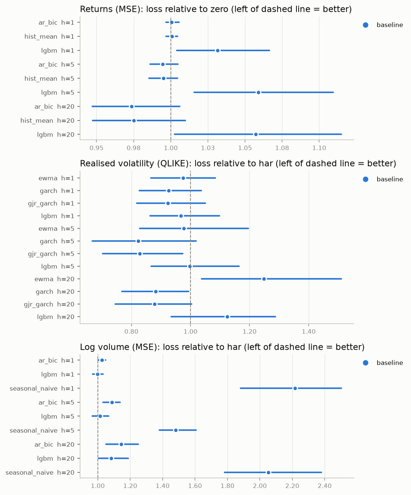
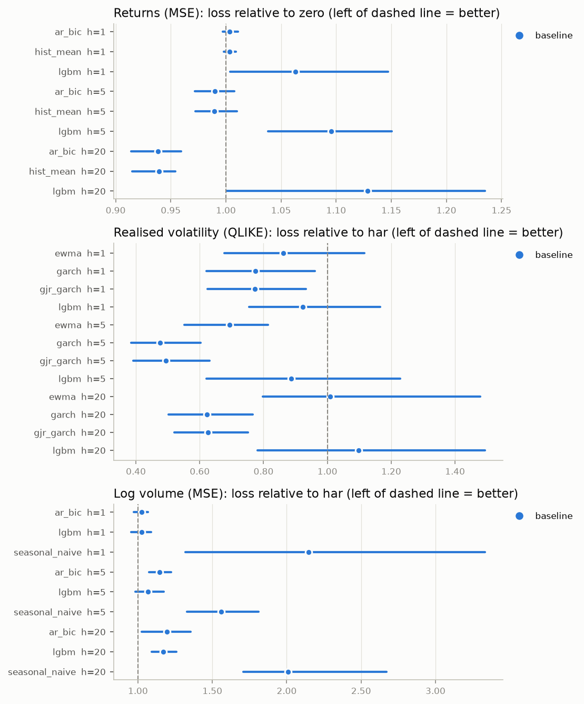
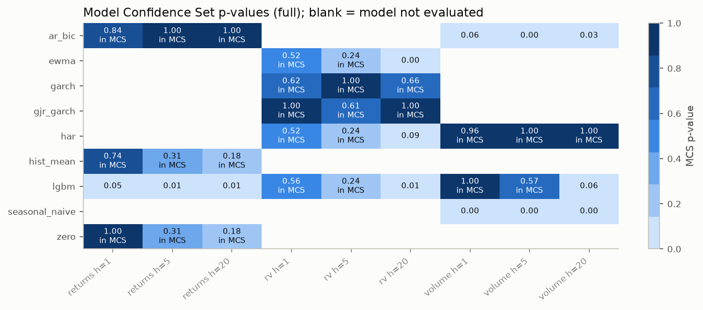
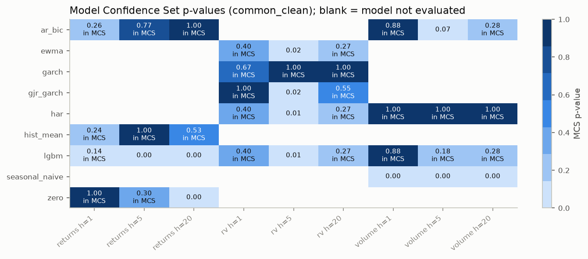
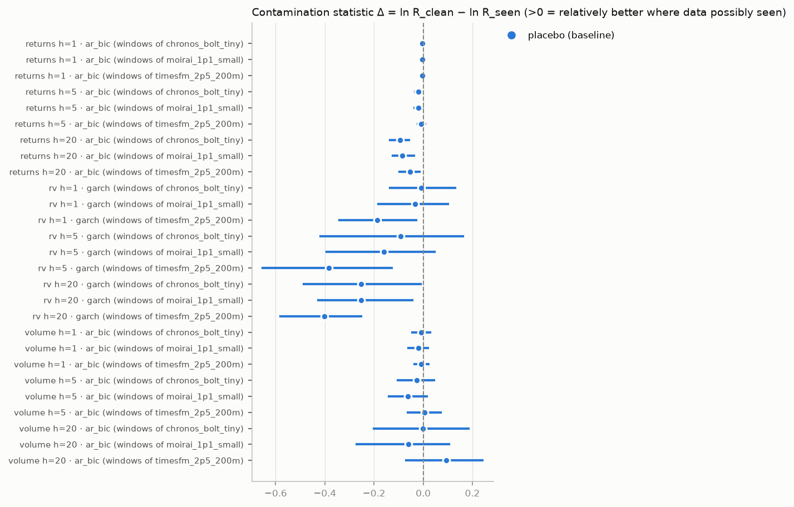
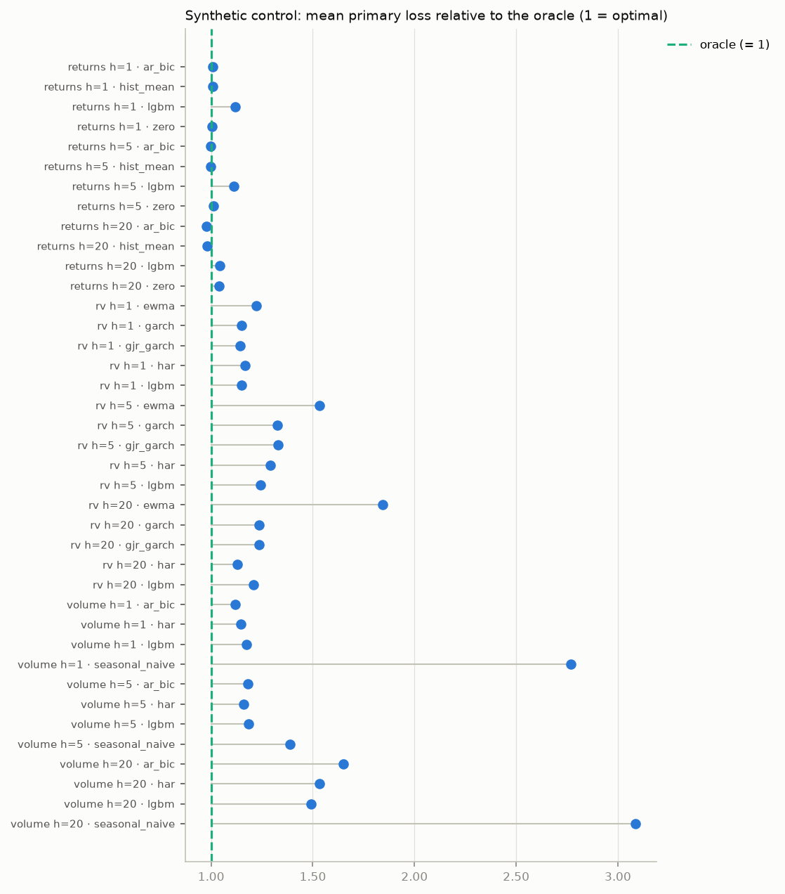

# Results: `smoke`

Generated by `tsfm-rc report` from the artifacts in `results/smoke/`. Nothing in this file is typed by hand: every number is read from a stored table whose SHA-256 is listed under Provenance, and rendering again from the same artifacts gives an identical file.

> **⚠️ SYNTHETIC FIXTURE DATA.** Every number in this report was computed on simulated
> series from `data/fixtures/` (GARCH/HAR processes with known parameters), not on market
> data. It demonstrates that the pipeline runs and is internally consistent; it says
> nothing about real markets or about the foundation models' real skill.

> **UNAVAILABLE models** (no numbers exist for them anywhere in this report):
> - `chronos_bolt_tiny`: could not download 'amazon/chronos-bolt-tiny' from Hugging Face (ProxyError: (MaxRetryError("HTTPSConnectionPool(host='huggingface.co', port=443): Max retries exceeded with url: /api/models/amazon/chronos-bolt-tiny/revis
> - `timesfm_2p5_200m`: could not download 'google/timesfm-2.5-200m-pytorch' from Hugging Face (ProxyError: (MaxRetryError("HTTPSConnectionPool(host='huggingface.co', port=443): Max retries exceeded with url: /api/models/google/timesfm-2.5-200m
> - `moirai_1p1_small`: could not download 'Salesforce/moirai-1.1-R-small' from Hugging Face (ProxyError: (MaxRetryError("HTTPSConnectionPool(host='huggingface.co', port=443): Max retries exceeded with url: /api/models/Salesforce/moirai-1.1-R-s

## 1. Summary in plain English

- **Primary question (TSFMs vs baselines): no answer from this run.** None of the pre-registered foundation models could be evaluated (see the UNAVAILABLE list above). This is an *absent* result, not a null result.
- **Returns (MSE)** (vs `zero`, full test period): no model is Holm-significantly better than the reference; none significantly worse.
- **Realised volatility (QLIKE)** (vs `har`, full test period): no model is Holm-significantly better than the reference; none significantly worse.
- **Log volume (MSE)** (vs `har`, full test period): no model is Holm-significantly better than the reference; significantly worse: `seasonal_naive` h=1, `ar_bic` h=5, `seasonal_naive` h=5, `seasonal_naive` h=20.
- MCS (α = 0.10, full period) for returns h=1: {`hist_mean`, `ar_bic`, `zero`}.
- MCS (α = 0.10, full period) for returns h=5: {`zero`, `hist_mean`, `ar_bic`}.
- MCS (α = 0.10, full period) for returns h=20: {`zero`, `hist_mean`, `ar_bic`}.
- MCS (α = 0.10, full period) for rv h=1: {`har`, `ewma`, `lgbm`, `garch`, `gjr_garch`}.
- MCS (α = 0.10, full period) for rv h=5: {`lgbm`, `ewma`, `har`, `gjr_garch`, `garch`}.
- MCS (α = 0.10, full period) for rv h=20: {`garch`, `gjr_garch`}.
- MCS (α = 0.10, full period) for volume h=1: {`har`, `lgbm`}.
- MCS (α = 0.10, full period) for volume h=5: {`lgbm`, `har`}.
- MCS (α = 0.10, full period) for volume h=20: {`har`}.
- **Synthetic control** (series no model can have seen): closest to the oracle: returns h=20: `ar_bic` (0.977× oracle loss); returns h=5: `ar_bic` (0.998× oracle loss); returns h=1: `zero` (1.005× oracle loss); volume h=1: `ar_bic` (1.119× oracle loss); rv h=20: `har` (1.130× oracle loss); rv h=1: `gjr_garch` (1.144× oracle loss); volume h=5: `har` (1.160× oracle loss); rv h=5: `lgbm` (1.244× oracle loss); volume h=20: `lgbm` (1.493× oracle loss).

## 2. Pre-registered primary tests (27)

Each TSFM vs the pre-registered reference baseline (returns: `zero`, rv: `har`, volume: `har`) on **stride-1 origins inside the model's own clean window** (amendment A4), pooled across assets, expanding window, primary loss. Relative loss < 1 means the TSFM is better. Test: Kiefer–Vogelsang fixed-b (Bartlett kernel, bandwidth T) with its own two-sided p-values; Holm over the family. "sim. size" is the worst rejection rate of this test under the null in the A4 simulation at the nearest simulated sample size not above T (nominal 5%; DECISIONS D-039).

| model | target | h | reference | rel. loss [95% CI] | t (KV) | p | Holm p | T | sim. size | verdict |
|---|---|---|---|---|---|---|---|---|---|---|
| chronos_bolt_tiny | returns | 1 | zero | UNAVAILABLE | – | – | – | – | – | – |
| chronos_bolt_tiny | returns | 5 | zero | UNAVAILABLE | – | – | – | – | – | – |
| chronos_bolt_tiny | returns | 20 | zero | UNAVAILABLE | – | – | – | – | – | – |
| chronos_bolt_tiny | rv | 1 | har | UNAVAILABLE | – | – | – | – | – | – |
| chronos_bolt_tiny | rv | 5 | har | UNAVAILABLE | – | – | – | – | – | – |
| chronos_bolt_tiny | rv | 20 | har | UNAVAILABLE | – | – | – | – | – | – |
| chronos_bolt_tiny | volume | 1 | har | UNAVAILABLE | – | – | – | – | – | – |
| chronos_bolt_tiny | volume | 5 | har | UNAVAILABLE | – | – | – | – | – | – |
| chronos_bolt_tiny | volume | 20 | har | UNAVAILABLE | – | – | – | – | – | – |
| timesfm_2p5_200m | returns | 1 | zero | UNAVAILABLE | – | – | – | – | – | – |
| timesfm_2p5_200m | returns | 5 | zero | UNAVAILABLE | – | – | – | – | – | – |
| timesfm_2p5_200m | returns | 20 | zero | UNAVAILABLE | – | – | – | – | – | – |
| timesfm_2p5_200m | rv | 1 | har | UNAVAILABLE | – | – | – | – | – | – |
| timesfm_2p5_200m | rv | 5 | har | UNAVAILABLE | – | – | – | – | – | – |
| timesfm_2p5_200m | rv | 20 | har | UNAVAILABLE | – | – | – | – | – | – |
| timesfm_2p5_200m | volume | 1 | har | UNAVAILABLE | – | – | – | – | – | – |
| timesfm_2p5_200m | volume | 5 | har | UNAVAILABLE | – | – | – | – | – | – |
| timesfm_2p5_200m | volume | 20 | har | UNAVAILABLE | – | – | – | – | – | – |
| moirai_1p1_small | returns | 1 | zero | UNAVAILABLE | – | – | – | – | – | – |
| moirai_1p1_small | returns | 5 | zero | UNAVAILABLE | – | – | – | – | – | – |
| moirai_1p1_small | returns | 20 | zero | UNAVAILABLE | – | – | – | – | – | – |
| moirai_1p1_small | rv | 1 | har | UNAVAILABLE | – | – | – | – | – | – |
| moirai_1p1_small | rv | 5 | har | UNAVAILABLE | – | – | – | – | – | – |
| moirai_1p1_small | rv | 20 | har | UNAVAILABLE | – | – | – | – | – | – |
| moirai_1p1_small | volume | 1 | har | UNAVAILABLE | – | – | – | – | – | – |
| moirai_1p1_small | volume | 5 | har | UNAVAILABLE | – | – | – | – | – | – |
| moirai_1p1_small | volume | 20 | har | UNAVAILABLE | – | – | – | – | – | – |

## 3. Which conclusions survive multiple-testing correction

A conclusion is listed as *surviving* only if its Holm-adjusted p-value is below 0.05 within its pre-specified family. Everything that was significant only before correction is listed separately and should **not** be reported as a finding.

| family | tests | raw p < α | Holm-significant |
|---|---|---|---|
| All models vs reference · common_clean · expanding window | 30 | 13 | 7 |
| All models vs reference · common_clean · rolling window | 30 | 9 | 2 |
| All models vs reference · full · expanding window | 30 | 13 | 4 |
| All models vs reference · full · rolling window | 30 | 12 | 8 |
| Per-asset tests · common_clean | 120 | 13 | 1 |
| Probabilistic h=1 (CRPS) · common_clean | 2 | 0 | 0 |
| Probabilistic h=1 (CRPS) · full | 2 | 1 | 0 |

**Survives correction:**

- All models vs reference · common_clean · expanding window: `ar_bic` vs `zero` · returns h=20: model **better** (p = 0.001, Holm p = 0.032)
- All models vs reference · common_clean · expanding window: `hist_mean` vs `zero` · returns h=20: model **better** (p = 0.001, Holm p = 0.029)
- All models vs reference · common_clean · expanding window: `ewma` vs `har` · rv h=5: model **better** (p = 0.001, Holm p = 0.028)
- All models vs reference · common_clean · expanding window: `garch` vs `har` · rv h=5: model **better** (p = 0.001, Holm p = 0.030)
- All models vs reference · common_clean · expanding window: `gjr_garch` vs `har` · rv h=5: model **better** (p = 0.001, Holm p = 0.033)
- All models vs reference · common_clean · expanding window: `seasonal_naive` vs `har` · volume h=5: model **worse** (p = <0.001, Holm p = 0.002)
- All models vs reference · common_clean · expanding window: `seasonal_naive` vs `har` · volume h=20: model **worse** (p = <0.001, Holm p = <0.001)
- All models vs reference · common_clean · rolling window: `seasonal_naive` vs `har` · volume h=5: model **worse** (p = <0.001, Holm p = 0.011)
- All models vs reference · common_clean · rolling window: `seasonal_naive` vs `har` · volume h=20: model **worse** (p = <0.001, Holm p = <0.001)
- All models vs reference · full · expanding window: `seasonal_naive` vs `har` · volume h=1: model **worse** (p = <0.001, Holm p = <0.001)
- All models vs reference · full · expanding window: `ar_bic` vs `har` · volume h=5: model **worse** (p = <0.001, Holm p = 0.009)
- All models vs reference · full · expanding window: `seasonal_naive` vs `har` · volume h=5: model **worse** (p = <0.001, Holm p = <0.001)
- All models vs reference · full · expanding window: `seasonal_naive` vs `har` · volume h=20: model **worse** (p = <0.001, Holm p = <0.001)
- All models vs reference · full · rolling window: `lgbm` vs `zero` · returns h=5: model **worse** (p = <0.001, Holm p = <0.001)
- All models vs reference · full · rolling window: `lgbm` vs `zero` · returns h=20: model **worse** (p = <0.001, Holm p = 0.005)
- All models vs reference · full · rolling window: `seasonal_naive` vs `har` · volume h=1: model **worse** (p = <0.001, Holm p = <0.001)
- All models vs reference · full · rolling window: `ar_bic` vs `har` · volume h=5: model **worse** (p = <0.001, Holm p = 0.019)
- All models vs reference · full · rolling window: `lgbm` vs `har` · volume h=5: model **worse** (p = <0.001, Holm p = 0.003)
- All models vs reference · full · rolling window: `seasonal_naive` vs `har` · volume h=5: model **worse** (p = <0.001, Holm p = <0.001)
- All models vs reference · full · rolling window: `lgbm` vs `har` · volume h=20: model **worse** (p = 0.001, Holm p = 0.024)
- All models vs reference · full · rolling window: `seasonal_naive` vs `har` · volume h=20: model **worse** (p = <0.001, Holm p = <0.001)
- Per-asset tests · common_clean: `seasonal_naive` vs `har` · volume h=20 · SYN_GARCH_B: model **worse** (p = <0.001, Holm p = <0.001)

**Significant before correction only (do not report as findings):**

- All models vs reference · common_clean · expanding window: `lgbm` vs `zero` · returns h=5: worse at raw p = 0.017, but Holm p = 0.307
- All models vs reference · common_clean · expanding window: `garch` vs `har` · rv h=20: better at raw p = 0.005, but Holm p = 0.108
- All models vs reference · common_clean · expanding window: `gjr_garch` vs `har` · rv h=20: better at raw p = 0.005, but Holm p = 0.105
- All models vs reference · common_clean · expanding window: `seasonal_naive` vs `har` · volume h=1: worse at raw p = 0.008, but Holm p = 0.166
- All models vs reference · common_clean · expanding window: `ar_bic` vs `har` · volume h=5: worse at raw p = 0.003, but Holm p = 0.070
- All models vs reference · common_clean · expanding window: `lgbm` vs `har` · volume h=20: worse at raw p = 0.012, but Holm p = 0.235
- All models vs reference · common_clean · rolling window: `lgbm` vs `zero` · returns h=5: worse at raw p = 0.007, but Holm p = 0.175
- All models vs reference · common_clean · rolling window: `lgbm` vs `zero` · returns h=20: worse at raw p = 0.003, but Holm p = 0.097
- All models vs reference · common_clean · rolling window: `garch` vs `har` · rv h=5: better at raw p = 0.004, but Holm p = 0.110
- All models vs reference · common_clean · rolling window: `gjr_garch` vs `har` · rv h=5: better at raw p = 0.020, but Holm p = 0.470
- All models vs reference · common_clean · rolling window: `seasonal_naive` vs `har` · volume h=1: worse at raw p = 0.008, but Holm p = 0.184
- All models vs reference · common_clean · rolling window: `ar_bic` vs `har` · volume h=5: worse at raw p = 0.004, but Holm p = 0.116
- All models vs reference · common_clean · rolling window: `lgbm` vs `har` · volume h=5: worse at raw p = 0.048, but Holm p = 1.000
- All models vs reference · full · expanding window: `lgbm` vs `zero` · returns h=5: worse at raw p = 0.022, but Holm p = 0.524
- All models vs reference · full · expanding window: `garch` vs `har` · rv h=5: better at raw p = 0.028, but Holm p = 0.655
- All models vs reference · full · expanding window: `gjr_garch` vs `har` · rv h=5: better at raw p = 0.033, but Holm p = 0.702
- All models vs reference · full · expanding window: `ewma` vs `har` · rv h=20: worse at raw p = 0.012, but Holm p = 0.308
- All models vs reference · full · expanding window: `garch` vs `har` · rv h=20: better at raw p = 0.037, but Holm p = 0.749
- All models vs reference · full · expanding window: `gjr_garch` vs `har` · rv h=20: better at raw p = 0.032, but Holm p = 0.702
- All models vs reference · full · expanding window: `ar_bic` vs `har` · volume h=1: worse at raw p = 0.049, but Holm p = 0.876
- All models vs reference · full · expanding window: `ar_bic` vs `har` · volume h=20: worse at raw p = 0.015, but Holm p = 0.382
- All models vs reference · full · expanding window: `lgbm` vs `har` · volume h=20: worse at raw p = 0.042, but Holm p = 0.805
- All models vs reference · full · rolling window: `lgbm` vs `har` · rv h=1: worse at raw p = 0.039, but Holm p = 0.747
- All models vs reference · full · rolling window: `ewma` vs `har` · rv h=20: worse at raw p = 0.033, but Holm p = 0.663
- All models vs reference · full · rolling window: `lgbm` vs `har` · rv h=20: worse at raw p = 0.031, but Holm p = 0.642
- All models vs reference · full · rolling window: `ar_bic` vs `har` · volume h=20: worse at raw p = 0.007, but Holm p = 0.147
- Per-asset tests · common_clean: `lgbm` vs `zero` · returns h=1 · SYN_GARCH_B: worse at raw p = 0.044, but Holm p = 1.000
- Per-asset tests · common_clean: `lgbm` vs `zero` · returns h=5 · SYN_QUIRKS: worse at raw p = 0.031, but Holm p = 1.000
- Per-asset tests · common_clean: `garch` vs `har` · rv h=5 · SYN_GARCH_A: better at raw p = 0.001, but Holm p = 0.155
- Per-asset tests · common_clean: `gjr_garch` vs `har` · rv h=5 · SYN_GARCH_A: better at raw p = 0.001, but Holm p = 0.175
- Per-asset tests · common_clean: `seasonal_naive` vs `har` · volume h=1 · SYN_GARCH_B: worse at raw p = 0.007, but Holm p = 0.784
- Per-asset tests · common_clean: `seasonal_naive` vs `har` · volume h=1 · SYN_QUIRKS: worse at raw p = 0.014, but Holm p = 1.000
- Per-asset tests · common_clean: `seasonal_naive` vs `har` · volume h=5 · SYN_GARCH_B: worse at raw p = 0.003, but Holm p = 0.352
- Per-asset tests · common_clean: `seasonal_naive` vs `har` · volume h=5 · SYN_HAR_A: worse at raw p = 0.019, but Holm p = 1.000
- Per-asset tests · common_clean: `seasonal_naive` vs `har` · volume h=5 · SYN_QUIRKS: worse at raw p = 0.043, but Holm p = 1.000
- Per-asset tests · common_clean: `ar_bic` vs `har` · volume h=20 · SYN_GARCH_A: worse at raw p = 0.003, but Holm p = 0.299
- Per-asset tests · common_clean: `lgbm` vs `har` · volume h=20 · SYN_GARCH_A: worse at raw p = 0.023, but Holm p = 1.000
- Per-asset tests · common_clean: `seasonal_naive` vs `har` · volume h=20 · SYN_QUIRKS: worse at raw p = 0.044, but Holm p = 1.000
- Probabilistic h=1 (CRPS) · full: `ar_bic` vs `hist_mean` · returns h=1: worse at raw p = 0.046, but Holm p = 0.091

**Contamination tests surviving Holm and exceeding the placebo:** 0.

## 4. All models vs reference (secondary)

Pooled relative loss with 95% stationary-bootstrap CI. `full` = whole test period (possibly contaminated for TSFMs); `common_clean` = after the latest TSFM release + 30 days.

### full · expanding window

| target | h | model | reference | loss | rel. loss [95% CI] | DM | p | Holm p | T | flags |
|---|---|---|---|---|---|---|---|---|---|---|
| returns | 1 | ar_bic | zero | MSE | 1.001 [0.997, 1.005] | 0.26 | 0.799 | 1.000 | 88 | small_sample |
| returns | 1 | hist_mean | zero | MSE | 1.001 [0.997, 1.005] | 0.31 | 0.757 | 1.000 | 88 | small_sample |
| returns | 1 | lgbm | zero | MSE | 1.032 [1.004, 1.066] | 1.86 | 0.067 | 1.000 | 88 | small_sample |
| returns | 5 | ar_bic | zero | MSE | 0.995 [0.986, 1.005] | -1.01 | 0.316 | 1.000 | 87 | small_sample |
| returns | 5 | hist_mean | zero | MSE | 0.995 [0.985, 1.004] | -0.93 | 0.358 | 1.000 | 87 | small_sample |
| returns | 5 | lgbm | zero | MSE | 1.059 [1.016, 1.109] | 2.34 | 0.022 | 0.524 | 87 | small_sample |
| returns | 20 | ar_bic | zero | MSE | 0.974 [0.947, 1.006] | -1.67 | 0.099 | 1.000 | 86 | small_sample |
| returns | 20 | hist_mean | zero | MSE | 0.975 [0.948, 1.010] | -1.60 | 0.114 | 1.000 | 86 | small_sample |
| returns | 20 | lgbm | zero | MSE | 1.057 [1.002, 1.115] | 1.70 | 0.093 | 1.000 | 86 | small_sample |
| rv | 1 | ewma | har | QLIKE | 0.975 [0.866, 1.084] | -0.39 | 0.695 | 1.000 | 88 | small_sample |
| rv | 1 | garch | har | QLIKE | 0.925 [0.827, 1.036] | -1.22 | 0.227 | 1.000 | 88 | small_sample |
| rv | 1 | gjr_garch | har | QLIKE | 0.923 [0.818, 1.050] | -1.25 | 0.215 | 1.000 | 88 | small_sample |
| rv | 1 | lgbm | har | QLIKE | 0.968 [0.864, 1.098] | -0.59 | 0.556 | 1.000 | 88 | small_sample |
| rv | 5 | ewma | har | QLIKE | 0.978 [0.829, 1.196] | -0.27 | 0.790 | 1.000 | 87 | small_sample |
| rv | 5 | garch | har | QLIKE | 0.823 [0.668, 1.019] | -2.23 | 0.028 | 0.655 | 87 | small_sample |
| rv | 5 | gjr_garch | har | QLIKE | 0.828 [0.703, 0.973] | -2.17 | 0.033 | 0.702 | 87 | small_sample |
| rv | 5 | lgbm | har | QLIKE | 0.998 [0.867, 1.164] | -0.03 | 0.979 | 1.000 | 87 | small_sample |
| rv | 20 | ewma | har | QLIKE | 1.248 [1.038, 1.510] | 2.57 | 0.012 | 0.308 | 86 | small_sample |
| rv | 20 | garch | har | QLIKE | 0.882 [0.768, 0.994] | -2.11 | 0.037 | 0.749 | 86 | small_sample |
| rv | 20 | gjr_garch | har | QLIKE | 0.878 [0.745, 1.004] | -2.18 | 0.032 | 0.702 | 86 | small_sample |
| rv | 20 | lgbm | har | QLIKE | 1.124 [0.935, 1.288] | 1.32 | 0.192 | 1.000 | 86 | small_sample |
| volume | 1 | ar_bic | har | MSE | 1.025 [1.003, 1.049] | 2.00 | 0.049 | 0.876 | 88 | small_sample |
| volume | 1 | lgbm | har | MSE | 0.999 [0.970, 1.032] | -0.07 | 0.947 | 1.000 | 88 | small_sample |
| volume | 1 | seasonal_naive | har | MSE | 2.217 [1.881, 2.503] | 7.37 | <0.001 | <0.001 | 88 | small_sample |
| volume | 5 | ar_bic | har | MSE | 1.086 [1.033, 1.138] | 3.72 | <0.001 | 0.009 | 87 | small_sample |
| volume | 5 | lgbm | har | MSE | 1.014 [0.967, 1.067] | 0.54 | 0.591 | 1.000 | 87 | small_sample |
| volume | 5 | seasonal_naive | har | MSE | 1.481 [1.379, 1.605] | 8.82 | <0.001 | <0.001 | 87 | small_sample |
| volume | 20 | ar_bic | har | MSE | 1.145 [1.051, 1.249] | 2.48 | 0.015 | 0.382 | 86 | small_sample |
| volume | 20 | lgbm | har | MSE | 1.083 [1.005, 1.187] | 2.06 | 0.042 | 0.805 | 86 | small_sample |
| volume | 20 | seasonal_naive | har | MSE | 2.052 [1.782, 2.378] | 7.51 | <0.001 | <0.001 | 86 | small_sample |

### common_clean · expanding window

| target | h | model | reference | loss | rel. loss [95% CI] | DM | p | Holm p | T | flags |
|---|---|---|---|---|---|---|---|---|---|---|
| returns | 1 | ar_bic | zero | MSE | 1.003 [0.997, 1.011] | 0.88 | 0.392 | 1.000 | 18 | small_sample |
| returns | 1 | hist_mean | zero | MSE | 1.003 [0.998, 1.009] | 0.91 | 0.377 | 1.000 | 18 | small_sample |
| returns | 1 | lgbm | zero | MSE | 1.063 [1.004, 1.147] | 1.56 | 0.136 | 1.000 | 18 | small_sample |
| returns | 5 | ar_bic | zero | MSE | 0.990 [0.972, 1.007] | -1.08 | 0.296 | 1.000 | 17 | small_sample |
| returns | 5 | hist_mean | zero | MSE | 0.990 [0.972, 1.010] | -1.13 | 0.274 | 1.000 | 17 | small_sample |
| returns | 5 | lgbm | zero | MSE | 1.095 [1.038, 1.151] | 2.66 | 0.017 | 0.307 | 17 | small_sample |
| returns | 20 | ar_bic | zero | MSE | 0.939 [0.914, 0.960] | -3.96 | 0.001 | 0.032 | 16 | small_sample |
| returns | 20 | hist_mean | zero | MSE | 0.939 [0.915, 0.954] | -4.04 | 0.001 | 0.029 | 16 | small_sample |
| returns | 20 | lgbm | zero | MSE | 1.128 [1.001, 1.235] | 1.47 | 0.162 | 1.000 | 16 | small_sample |
| rv | 1 | ewma | har | QLIKE | 0.862 [0.678, 1.116] | -1.05 | 0.307 | 1.000 | 18 | small_sample |
| rv | 1 | garch | har | QLIKE | 0.775 [0.621, 0.960] | -1.66 | 0.115 | 1.000 | 18 | small_sample |
| rv | 1 | gjr_garch | har | QLIKE | 0.773 [0.625, 0.933] | -1.70 | 0.107 | 1.000 | 18 | small_sample |
| rv | 1 | lgbm | har | QLIKE | 0.923 [0.754, 1.166] | -0.60 | 0.557 | 1.000 | 18 | small_sample |
| rv | 5 | ewma | har | QLIKE | 0.693 [0.552, 0.814] | -4.01 | 0.001 | 0.028 | 17 | small_sample |
| rv | 5 | garch | har | QLIKE | 0.476 [0.385, 0.603] | -3.95 | 0.001 | 0.030 | 17 | small_sample |
| rv | 5 | gjr_garch | har | QLIKE | 0.493 [0.391, 0.631] | -3.87 | 0.001 | 0.033 | 17 | small_sample |
| rv | 5 | lgbm | har | QLIKE | 0.886 [0.620, 1.228] | -0.55 | 0.590 | 1.000 | 17 | small_sample |
| rv | 20 | ewma | har | QLIKE | 1.009 [0.798, 1.478] | 0.05 | 0.964 | 1.000 | 16 | small_sample |
| rv | 20 | garch | har | QLIKE | 0.623 [0.503, 0.766] | -3.27 | 0.005 | 0.108 | 16 | small_sample |
| rv | 20 | gjr_garch | har | QLIKE | 0.627 [0.521, 0.751] | -3.31 | 0.005 | 0.105 | 16 | small_sample |
| rv | 20 | lgbm | har | QLIKE | 1.098 [0.781, 1.494] | 0.40 | 0.694 | 1.000 | 16 | small_sample |
| volume | 1 | ar_bic | har | MSE | 1.025 [0.972, 1.067] | 0.98 | 0.340 | 1.000 | 18 | small_sample |
| volume | 1 | lgbm | har | MSE | 1.023 [0.955, 1.090] | 0.71 | 0.487 | 1.000 | 18 | small_sample |
| volume | 1 | seasonal_naive | har | MSE | 2.148 [1.319, 3.333] | 2.99 | 0.008 | 0.166 | 18 | small_sample |
| volume | 5 | ar_bic | har | MSE | 1.147 [1.074, 1.222] | 3.49 | 0.003 | 0.070 | 17 | small_sample |
| volume | 5 | lgbm | har | MSE | 1.069 [0.982, 1.173] | 1.39 | 0.183 | 1.000 | 17 | small_sample |
| volume | 5 | seasonal_naive | har | MSE | 1.561 [1.329, 1.812] | 5.30 | <0.001 | 0.002 | 17 | small_sample |
| volume | 20 | ar_bic | har | MSE | 1.196 [1.025, 1.355] | 1.64 | 0.121 | 1.000 | 16 | small_sample |
| volume | 20 | lgbm | har | MSE | 1.169 [1.091, 1.259] | 2.84 | 0.012 | 0.235 | 16 | small_sample |
| volume | 20 | seasonal_naive | har | MSE | 2.010 [1.706, 2.671] | 5.86 | <0.001 | <0.001 | 16 | small_sample |

## 5. Robustness: rolling vs expanding window (baselines)

30 model/target/horizon comparisons exist in both variants; in **17** the direction (relative loss above/below 1) or Holm significance differs between the expanding and the rolling window.

| target | h | model | rel. loss (expanding) | Holm sig. | rel. loss (rolling) | Holm sig. |
|---|---|---|---|---|---|---|
| returns | 1 | ar_bic | 1.001 | False | 0.995 | False |
| returns | 1 | hist_mean | 1.001 | False | 0.994 | False |
| returns | 5 | ar_bic | 0.995 | False | 1.008 | False |
| returns | 5 | hist_mean | 0.995 | False | 1.008 | False |
| returns | 5 | lgbm | 1.059 | False | 1.154 | True |
| returns | 20 | lgbm | 1.057 | False | 1.316 | True |
| rv | 1 | ewma | 0.975 | False | 1.034 | False |
| rv | 1 | garch | 0.925 | False | 1.016 | False |
| rv | 1 | gjr_garch | 0.923 | False | 1.031 | False |
| rv | 1 | lgbm | 0.968 | False | 1.086 | False |
| rv | 5 | ewma | 0.978 | False | 1.088 | False |
| rv | 5 | garch | 0.823 | False | 1.001 | False |
| rv | 5 | gjr_garch | 0.828 | False | 1.053 | False |
| rv | 5 | lgbm | 0.998 | False | 1.208 | False |
| volume | 1 | lgbm | 0.999 | False | 1.053 | False |
| volume | 5 | lgbm | 1.014 | False | 1.192 | True |
| volume | 20 | lgbm | 1.083 | False | 1.359 | True |

## 6. Model Confidence Sets

Hansen–Lunde–Nason MCS, T_max statistic, α = 0.10, stationary bootstrap (B = 200), pooled normalised primary loss on (asset, origin) pairs where every model has a forecast.

| period | target | h | model | mean norm. loss | MCS p | in MCS | T |
|---|---|---|---|---|---|---|---|
| common_clean | returns | 1 | zero | 1.053 | 1.000 | yes | 18 |
| common_clean | returns | 1 | ar_bic | 1.056 | 0.255 | yes | 18 |
| common_clean | returns | 1 | hist_mean | 1.056 | 0.245 | yes | 18 |
| common_clean | returns | 1 | lgbm | 1.119 | 0.135 | yes | 18 |
| common_clean | returns | 5 | hist_mean | 0.667 | 1.000 | yes | 17 |
| common_clean | returns | 5 | ar_bic | 0.667 | 0.770 | yes | 17 |
| common_clean | returns | 5 | zero | 0.674 | 0.305 | yes | 17 |
| common_clean | returns | 5 | lgbm | 0.738 | <0.001 | no | 17 |
| common_clean | returns | 20 | ar_bic | 0.994 | 1.000 | yes | 16 |
| common_clean | returns | 20 | hist_mean | 0.995 | 0.525 | yes | 16 |
| common_clean | returns | 20 | lgbm | 1.195 | <0.001 | no | 16 |
| common_clean | returns | 20 | zero | 1.059 | <0.001 | no | 16 |
| common_clean | rv | 1 | gjr_garch | 0.152 | 1.000 | yes | 18 |
| common_clean | rv | 1 | garch | 0.152 | 0.670 | yes | 18 |
| common_clean | rv | 1 | har | 0.196 | 0.395 | yes | 18 |
| common_clean | rv | 1 | lgbm | 0.181 | 0.395 | yes | 18 |
| common_clean | rv | 1 | ewma | 0.169 | 0.395 | yes | 18 |
| common_clean | rv | 5 | garch | 0.048 | 1.000 | yes | 17 |
| common_clean | rv | 5 | ewma | 0.070 | 0.020 | no | 17 |
| common_clean | rv | 5 | gjr_garch | 0.050 | 0.020 | no | 17 |
| common_clean | rv | 5 | har | 0.101 | 0.005 | no | 17 |
| common_clean | rv | 5 | lgbm | 0.090 | 0.005 | no | 17 |
| common_clean | rv | 20 | garch | 0.050 | 1.000 | yes | 16 |
| common_clean | rv | 20 | gjr_garch | 0.050 | 0.545 | yes | 16 |
| common_clean | rv | 20 | har | 0.080 | 0.265 | yes | 16 |
| common_clean | rv | 20 | lgbm | 0.088 | 0.265 | yes | 16 |
| common_clean | rv | 20 | ewma | 0.081 | 0.265 | yes | 16 |
| common_clean | volume | 1 | har | 0.796 | 1.000 | yes | 18 |
| common_clean | volume | 1 | ar_bic | 0.816 | 0.875 | yes | 18 |
| common_clean | volume | 1 | lgbm | 0.815 | 0.875 | yes | 18 |
| common_clean | volume | 1 | seasonal_naive | 1.710 | <0.001 | no | 18 |
| common_clean | volume | 5 | har | 0.607 | 1.000 | yes | 17 |
| common_clean | volume | 5 | lgbm | 0.648 | 0.185 | yes | 17 |
| common_clean | volume | 5 | ar_bic | 0.696 | 0.070 | no | 17 |
| common_clean | volume | 5 | seasonal_naive | 0.947 | <0.001 | no | 17 |
| common_clean | volume | 20 | har | 0.626 | 1.000 | yes | 16 |
| common_clean | volume | 20 | ar_bic | 0.749 | 0.275 | yes | 16 |
| common_clean | volume | 20 | lgbm | 0.732 | 0.275 | yes | 16 |
| common_clean | volume | 20 | seasonal_naive | 1.258 | <0.001 | no | 16 |
| full | returns | 1 | zero | 0.840 | 1.000 | yes | 88 |
| full | returns | 1 | ar_bic | 0.840 | 0.845 | yes | 88 |
| full | returns | 1 | hist_mean | 0.841 | 0.740 | yes | 88 |
| full | returns | 1 | lgbm | 0.867 | 0.050 | no | 88 |
| full | returns | 5 | ar_bic | 0.677 | 1.000 | yes | 87 |
| full | returns | 5 | zero | 0.680 | 0.310 | yes | 87 |
| full | returns | 5 | hist_mean | 0.677 | 0.310 | yes | 87 |
| full | returns | 5 | lgbm | 0.720 | 0.015 | no | 87 |
| full | returns | 20 | ar_bic | 0.826 | 1.000 | yes | 86 |
| full | returns | 20 | zero | 0.849 | 0.185 | yes | 86 |
| full | returns | 20 | hist_mean | 0.828 | 0.185 | yes | 86 |
| full | returns | 20 | lgbm | 0.897 | 0.015 | no | 86 |
| full | rv | 1 | gjr_garch | 0.171 | 1.000 | yes | 88 |
| full | rv | 1 | garch | 0.171 | 0.625 | yes | 88 |
| full | rv | 1 | lgbm | 0.179 | 0.560 | yes | 88 |
| full | rv | 1 | har | 0.185 | 0.520 | yes | 88 |
| full | rv | 1 | ewma | 0.180 | 0.520 | yes | 88 |
| full | rv | 5 | garch | 0.070 | 1.000 | yes | 87 |
| full | rv | 5 | gjr_garch | 0.070 | 0.615 | yes | 87 |
| full | rv | 5 | lgbm | 0.085 | 0.245 | yes | 87 |
| full | rv | 5 | ewma | 0.083 | 0.245 | yes | 87 |
| full | rv | 5 | har | 0.085 | 0.245 | yes | 87 |
| full | rv | 20 | gjr_garch | 0.061 | 1.000 | yes | 86 |
| full | rv | 20 | garch | 0.061 | 0.660 | yes | 86 |
| full | rv | 20 | har | 0.069 | 0.085 | no | 86 |
| full | rv | 20 | lgbm | 0.078 | 0.005 | no | 86 |
| full | rv | 20 | ewma | 0.086 | <0.001 | no | 86 |
| full | volume | 1 | lgbm | 0.658 | 1.000 | yes | 88 |
| full | volume | 1 | har | 0.659 | 0.965 | yes | 88 |
| full | volume | 1 | ar_bic | 0.676 | 0.060 | no | 88 |
| full | volume | 1 | seasonal_naive | 1.461 | <0.001 | no | 88 |
| full | volume | 5 | har | 0.652 | 1.000 | yes | 87 |
| full | volume | 5 | lgbm | 0.662 | 0.575 | yes | 87 |
| full | volume | 5 | seasonal_naive | 0.966 | <0.001 | no | 87 |
| full | volume | 5 | ar_bic | 0.709 | <0.001 | no | 87 |
| full | volume | 20 | har | 0.649 | 1.000 | yes | 86 |
| full | volume | 20 | lgbm | 0.703 | 0.055 | no | 86 |
| full | volume | 20 | ar_bic | 0.743 | 0.025 | no | 86 |
| full | volume | 20 | seasonal_naive | 1.332 | <0.001 | no | 86 |

## 7. Probabilistic forecasts (h = 1)

CRPS approximated from the nine deciles (DECISIONS D-012), normalised by the pre-test standard deviation, and raw pinball losses at τ = 0.1, 0.5, 0.9 (target units); reference: returns → `hist_mean`, rv → `har`, volume → `har`.

| period | target | model | mean CRPS (norm.) | pinball τ=0.1 | pinball τ=0.5 | pinball τ=0.9 | p vs ref (CRPS) | Holm p |
|---|---|---|---|---|---|---|---|---|
| common_clean | returns | ar_bic | 0.621 | 0.274 | 0.517 | 0.217 | 0.274 | 0.548 |
| common_clean | returns | hist_mean | 0.626 | 0.293 | 0.516 | 0.216 | – | – |
| common_clean | rv | har | 0.279 | 0.105 | 0.329 | 0.224 | – | – |
| common_clean | volume | har | 0.558 | 0.051 | 0.118 | 0.050 | – | – |
| common_clean | volume | ar_bic | 0.561 | 0.054 | 0.117 | 0.050 | 0.671 | 0.671 |
| full | returns | hist_mean | 0.553 | 0.211 | 0.460 | 0.215 | – | – |
| full | returns | ar_bic | 0.557 | 0.211 | 0.459 | 0.218 | 0.046 | 0.091 |
| full | rv | har | 0.268 | 0.089 | 0.285 | 0.180 | – | – |
| full | volume | har | 0.503 | 0.045 | 0.106 | 0.049 | – | – |
| full | volume | ar_bic | 0.509 | 0.046 | 0.107 | 0.049 | 0.073 | 0.091 |

## 8. Contamination control

Δ = ln R_clean − ln R_seen with R = (TSFM loss)/(reference loss); Δ > 0 would be consistent with memorisation. Placebo rows apply the same statistic to baselines that cannot memorise, on the same windows, to show how much market-regime differences alone move Δ. The seen side uses the main stride-5 origins; the clean side uses the stride-1 origins of the primary pass (amendment A4), each resampled with a block length set by its own overlap.

| model | release_date | weights_date | effective_release | clean_start | common_clean_start |
|---|---|---|---|---|---|
| chronos_bolt_tiny | 2024-11-26 | None | 2024-11-26 | 2024-12-26 | 2025-10-15 |
| timesfm_2p5_200m | 2025-09-15 | None | 2025-09-15 | 2025-10-15 | 2025-10-15 |
| moirai_1p1_small | 2024-06-30 | None | 2024-06-30 | 2024-07-30 | 2025-10-15 |

| windows of | role | model | target | h | Δ | 95% CI | p (Δ>0) | Holm p | T seen/clean |
|---|---|---|---|---|---|---|---|---|---|
| chronos_bolt_tiny | placebo | ar_bic | returns | 1 | -0.004 | [-0.011, 0.004] | 0.860 | – | 48/377 |
| chronos_bolt_tiny | tsfm | chronos_bolt_tiny | returns | 1 | UNAVAILABLE | – | – | – | – |
| chronos_bolt_tiny | placebo | ar_bic | returns | 5 | -0.019 | [-0.033, -0.005] | 0.990 | – | 48/373 |
| chronos_bolt_tiny | tsfm | chronos_bolt_tiny | returns | 5 | UNAVAILABLE | – | – | – | – |
| chronos_bolt_tiny | placebo | ar_bic | returns | 20 | -0.095 | [-0.134, -0.057] | 1.000 | – | 46/358 |
| chronos_bolt_tiny | tsfm | chronos_bolt_tiny | returns | 20 | UNAVAILABLE | – | – | – | – |
| chronos_bolt_tiny | placebo | garch | rv | 1 | -0.007 | [-0.135, 0.130] | 0.550 | – | 48/377 |
| chronos_bolt_tiny | tsfm | chronos_bolt_tiny | rv | 1 | UNAVAILABLE | – | – | – | – |
| chronos_bolt_tiny | placebo | garch | rv | 5 | -0.091 | [-0.418, 0.161] | 0.705 | – | 48/373 |
| chronos_bolt_tiny | tsfm | chronos_bolt_tiny | rv | 5 | UNAVAILABLE | – | – | – | – |
| chronos_bolt_tiny | placebo | garch | rv | 20 | -0.253 | [-0.485, -0.011] | 0.985 | – | 46/358 |
| chronos_bolt_tiny | tsfm | chronos_bolt_tiny | rv | 20 | UNAVAILABLE | – | – | – | – |
| chronos_bolt_tiny | placebo | ar_bic | volume | 1 | -0.009 | [-0.046, 0.028] | 0.665 | – | 48/377 |
| chronos_bolt_tiny | tsfm | chronos_bolt_tiny | volume | 1 | UNAVAILABLE | – | – | – | – |
| chronos_bolt_tiny | placebo | ar_bic | volume | 5 | -0.027 | [-0.103, 0.043] | 0.780 | – | 48/373 |
| chronos_bolt_tiny | tsfm | chronos_bolt_tiny | volume | 5 | UNAVAILABLE | – | – | – | – |
| chronos_bolt_tiny | placebo | ar_bic | volume | 20 | -0.001 | [-0.200, 0.183] | 0.525 | – | 46/358 |
| chronos_bolt_tiny | tsfm | chronos_bolt_tiny | volume | 20 | UNAVAILABLE | – | – | – | – |
| moirai_1p1_small | placebo | ar_bic | returns | 1 | -0.004 | [-0.013, 0.006] | 0.780 | – | 38/479 |
| moirai_1p1_small | tsfm | moirai_1p1_small | returns | 1 | UNAVAILABLE | – | – | – | – |
| moirai_1p1_small | placebo | ar_bic | returns | 5 | -0.019 | [-0.035, -0.003] | 0.980 | – | 37/475 |
| moirai_1p1_small | tsfm | moirai_1p1_small | returns | 5 | UNAVAILABLE | – | – | – | – |
| moirai_1p1_small | placebo | ar_bic | returns | 20 | -0.085 | [-0.124, -0.038] | 1.000 | – | 36/460 |
| moirai_1p1_small | tsfm | moirai_1p1_small | returns | 20 | UNAVAILABLE | – | – | – | – |
| moirai_1p1_small | placebo | garch | rv | 1 | -0.034 | [-0.183, 0.100] | 0.740 | – | 38/479 |
| moirai_1p1_small | tsfm | moirai_1p1_small | rv | 1 | UNAVAILABLE | – | – | – | – |
| moirai_1p1_small | placebo | garch | rv | 5 | -0.160 | [-0.393, 0.046] | 0.925 | – | 37/475 |
| moirai_1p1_small | tsfm | moirai_1p1_small | rv | 5 | UNAVAILABLE | – | – | – | – |
| moirai_1p1_small | placebo | garch | rv | 20 | -0.252 | [-0.426, -0.044] | 0.990 | – | 36/460 |
| moirai_1p1_small | tsfm | moirai_1p1_small | rv | 20 | UNAVAILABLE | – | – | – | – |
| moirai_1p1_small | placebo | ar_bic | volume | 1 | -0.020 | [-0.060, 0.020] | 0.840 | – | 38/479 |
| moirai_1p1_small | tsfm | moirai_1p1_small | volume | 1 | UNAVAILABLE | – | – | – | – |
| moirai_1p1_small | placebo | ar_bic | volume | 5 | -0.062 | [-0.139, 0.014] | 0.925 | – | 37/475 |
| moirai_1p1_small | tsfm | moirai_1p1_small | volume | 5 | UNAVAILABLE | – | – | – | – |
| moirai_1p1_small | placebo | ar_bic | volume | 20 | -0.061 | [-0.270, 0.105] | 0.770 | – | 36/460 |
| moirai_1p1_small | tsfm | moirai_1p1_small | volume | 20 | UNAVAILABLE | – | – | – | – |
| timesfm_2p5_200m | placebo | ar_bic | returns | 1 | -0.004 | [-0.010, 0.003] | 0.860 | – | 68/176 |
| timesfm_2p5_200m | tsfm | timesfm_2p5_200m | returns | 1 | UNAVAILABLE | – | – | – | – |
| timesfm_2p5_200m | placebo | ar_bic | returns | 5 | -0.009 | [-0.023, 0.008] | 0.835 | – | 68/172 |
| timesfm_2p5_200m | tsfm | timesfm_2p5_200m | returns | 5 | UNAVAILABLE | – | – | – | – |
| timesfm_2p5_200m | placebo | ar_bic | returns | 20 | -0.052 | [-0.096, -0.015] | 0.995 | – | 66/157 |
| timesfm_2p5_200m | tsfm | timesfm_2p5_200m | returns | 20 | UNAVAILABLE | – | – | – | – |
| timesfm_2p5_200m | placebo | garch | rv | 1 | -0.187 | [-0.341, -0.028] | 0.985 | – | 68/176 |
| timesfm_2p5_200m | tsfm | timesfm_2p5_200m | rv | 1 | UNAVAILABLE | – | – | – | – |
| timesfm_2p5_200m | placebo | garch | rv | 5 | -0.383 | [-0.652, -0.128] | 1.000 | – | 68/172 |
| timesfm_2p5_200m | tsfm | timesfm_2p5_200m | rv | 5 | UNAVAILABLE | – | – | – | – |
| timesfm_2p5_200m | placebo | garch | rv | 20 | -0.402 | [-0.582, -0.252] | 1.000 | – | 66/157 |
| timesfm_2p5_200m | tsfm | timesfm_2p5_200m | rv | 20 | UNAVAILABLE | – | – | – | – |
| timesfm_2p5_200m | placebo | ar_bic | volume | 1 | -0.008 | [-0.036, 0.022] | 0.725 | – | 68/176 |
| timesfm_2p5_200m | tsfm | timesfm_2p5_200m | volume | 1 | UNAVAILABLE | – | – | – | – |
| timesfm_2p5_200m | placebo | ar_bic | volume | 5 | 0.005 | [-0.062, 0.072] | 0.425 | – | 68/172 |
| timesfm_2p5_200m | tsfm | timesfm_2p5_200m | volume | 5 | UNAVAILABLE | – | – | – | – |
| timesfm_2p5_200m | placebo | ar_bic | volume | 20 | 0.094 | [-0.069, 0.242] | 0.120 | – | 66/157 |
| timesfm_2p5_200m | tsfm | timesfm_2p5_200m | volume | 20 | UNAVAILABLE | – | – | – | – |

Placebo Δ ranged from -0.402 to 0.094; 10 of 27 placebo CIs exclude 0, which shows how easily the seen/clean comparison moves without any memorisation.

## 9. Synthetic control

3 simulated series (GARCH(1,1) and HAR-type variance, calibrated on `SYN_GARCH_A`), 300 test days each. The oracle knows the true conditional expectation. Ratios > 1 = worse than optimal. The oracle is optimal *in expectation*, so in a finite sample a model can land slightly below 1 by chance; the DM p-value against the oracle says whether a gap is distinguishable from noise.

| target | h | model | loss | mean loss | × oracle (proxy) | × oracle (latent) | DM p vs oracle |
|---|---|---|---|---|---|---|---|
| returns | 1 | oracle | MSE | 0.859 | 1.000 | – | – |
| returns | 1 | zero | MSE | 0.863 | 1.005 | – | 0.382 |
| returns | 1 | ar_bic | MSE | 0.866 | 1.008 | – | 0.288 |
| returns | 1 | hist_mean | MSE | 0.866 | 1.008 | – | 0.278 |
| returns | 1 | lgbm | MSE | 0.961 | 1.119 | – | 0.007 |
| returns | 5 | ar_bic | MSE | 4.234 | 0.998 | – | 0.885 |
| returns | 5 | hist_mean | MSE | 4.237 | 0.998 | – | 0.915 |
| returns | 5 | oracle | MSE | 4.245 | 1.000 | – | – |
| returns | 5 | zero | MSE | 4.288 | 1.010 | – | 0.415 |
| returns | 5 | lgbm | MSE | 4.723 | 1.113 | – | 0.079 |
| returns | 20 | ar_bic | MSE | 13.705 | 0.977 | – | 0.637 |
| returns | 20 | hist_mean | MSE | 13.728 | 0.979 | – | 0.661 |
| returns | 20 | oracle | MSE | 14.023 | 1.000 | – | – |
| returns | 20 | zero | MSE | 14.592 | 1.041 | – | 0.295 |
| returns | 20 | lgbm | MSE | 14.604 | 1.041 | – | 0.554 |
| rv | 1 | oracle | QLIKE | 0.174 | 1.000 | 1.000 | – |
| rv | 1 | gjr_garch | QLIKE | 0.199 | 1.144 | 1.938 | 0.035 |
| rv | 1 | garch | QLIKE | 0.200 | 1.148 | 1.944 | 0.035 |
| rv | 1 | lgbm | QLIKE | 0.200 | 1.149 | 1.995 | 0.051 |
| rv | 1 | har | QLIKE | 0.203 | 1.168 | 1.818 | 0.016 |
| rv | 1 | ewma | QLIKE | 0.212 | 1.221 | 2.259 | 0.013 |
| rv | 5 | oracle | QLIKE | 0.055 | 1.000 | 1.000 | – |
| rv | 5 | lgbm | QLIKE | 0.068 | 1.244 | 2.295 | 0.175 |
| rv | 5 | har | QLIKE | 0.071 | 1.290 | 2.300 | 0.062 |
| rv | 5 | garch | QLIKE | 0.073 | 1.324 | 2.000 | 0.023 |
| rv | 5 | gjr_garch | QLIKE | 0.073 | 1.328 | 2.004 | 0.019 |
| rv | 5 | ewma | QLIKE | 0.084 | 1.533 | 2.633 | 0.002 |
| rv | 20 | oracle | QLIKE | 0.043 | 1.000 | 1.000 | – |
| rv | 20 | har | QLIKE | 0.048 | 1.130 | 1.309 | 0.313 |
| rv | 20 | lgbm | QLIKE | 0.052 | 1.208 | 1.499 | 0.208 |
| rv | 20 | garch | QLIKE | 0.053 | 1.236 | 1.329 | 0.145 |
| rv | 20 | gjr_garch | QLIKE | 0.053 | 1.237 | 1.335 | 0.140 |
| rv | 20 | ewma | QLIKE | 0.079 | 1.845 | 2.184 | 0.002 |
| volume | 1 | oracle | MSE | 0.064 | 1.000 | – | – |
| volume | 1 | ar_bic | MSE | 0.071 | 1.119 | – | 0.151 |
| volume | 1 | har | MSE | 0.073 | 1.144 | – | 0.075 |
| volume | 1 | lgbm | MSE | 0.075 | 1.174 | – | 0.072 |
| volume | 1 | seasonal_naive | MSE | 0.176 | 2.770 | – | <0.001 |
| volume | 5 | oracle | MSE | 0.042 | 1.000 | – | – |
| volume | 5 | har | MSE | 0.049 | 1.160 | – | 0.026 |
| volume | 5 | ar_bic | MSE | 0.050 | 1.181 | – | 0.055 |
| volume | 5 | lgbm | MSE | 0.050 | 1.183 | – | 0.045 |
| volume | 5 | seasonal_naive | MSE | 0.059 | 1.387 | – | 0.068 |
| volume | 20 | oracle | MSE | 0.016 | 1.000 | – | – |
| volume | 20 | lgbm | MSE | 0.024 | 1.493 | – | 0.019 |
| volume | 20 | har | MSE | 0.025 | 1.532 | – | <0.001 |
| volume | 20 | ar_bic | MSE | 0.027 | 1.652 | – | 0.010 |
| volume | 20 | seasonal_naive | MSE | 0.050 | 3.085 | – | <0.001 |

## 10. Economic evaluation (illustrative only; not a trading claim)

Volatility targeting on `SYN_GARCH_A`: weight = min(2.0, 10% / forecast vol) from the h=5 volatility forecast, rebalanced at each origin, 5 bp per unit turnover, cash earns 0. All models are evaluated on the same dates. Because the GK target omits overnight moves, realised volatility sits above target for all models.

| period | model | ann. return | ann. vol | Sharpe | max DD | avg weight | turnover/yr |
|---|---|---|---|---|---|---|---|
| common_clean | buy_and_hold | 0.218 | 0.136 | 1.61 | -0.089 | 1.00 | 0.00 |
| common_clean | ewma | 0.153 | 0.097 | 1.58 | -0.063 | 0.78 | 2.94 |
| common_clean | garch | 0.145 | 0.097 | 1.49 | -0.069 | 0.77 | 3.03 |
| common_clean | gjr_garch | 0.144 | 0.097 | 1.49 | -0.069 | 0.76 | 2.90 |
| common_clean | har | 0.147 | 0.094 | 1.56 | -0.062 | 0.75 | 2.52 |
| common_clean | lgbm | 0.147 | 0.091 | 1.61 | -0.064 | 0.73 | 2.37 |
| full | buy_and_hold | 0.193 | 0.148 | 1.30 | -0.148 | 1.00 | 0.00 |
| full | ewma | 0.144 | 0.108 | 1.33 | -0.094 | 0.79 | 2.71 |
| full | garch | 0.141 | 0.105 | 1.35 | -0.097 | 0.76 | 2.48 |
| full | gjr_garch | 0.140 | 0.104 | 1.35 | -0.096 | 0.76 | 2.42 |
| full | har | 0.140 | 0.104 | 1.35 | -0.094 | 0.75 | 2.27 |
| full | lgbm | 0.138 | 0.102 | 1.36 | -0.092 | 0.73 | 2.11 |

## 11. Data and cleaning

Every data adjustment is listed row by row in `cleaning_report.csv`. Summary:

| issue | action | count |
|---|---|---|
| duplicate_date | dropped_earlier_copy | 1 |
| missing_day | flagged_only | 2 |
| ohlc_violation | repaired_high_low | 1 |
| stale_row | dropped | 1 |
| suspect_split | flagged_only | 1 |
| weekend_row | dropped | 1 |
| zero_volume | volume_set_missing | 1 |

Forecast rows without a realised target (end of sample or missing inputs), excluded from evaluation:

| target | horizon | n_missing_target |
|---|---|---|
| returns | 1 | 0 |
| returns | 5 | 32 |
| returns | 20 | 64 |
| rv | 1 | 0 |
| rv | 5 | 40 |
| rv | 20 | 80 |
| volume | 1 | 0 |
| volume | 5 | 32 |
| volume | 20 | 64 |

## 12. Limitations

- **Synthetic data.** This run uses simulated fixtures; nothing here generalises to markets.
- **Missing models.** At least one TSFM was UNAVAILABLE, so the primary question is only partly (or not) answered.
- **Small samples.** 120 tests use fewer than 100 origins; the simulation behind amendment A2 shows DM-HLN over-rejects somewhat at T≈50, so treat marginal p-values there with caution.
- **Survivorship bias.** The stock list conditions on firms that are large in 2026 (DECISIONS D-003).
- **Volatility proxy.** Garman–Klass measures open-to-close variance; overnight moves are excluded for every model.
- **Pretraining corpora are only partly documented.** See the verification tags in `docs/PRETRAINING-DATA.md`; a null contamination result is not proof that the models never saw these series.
- **Regime confounding.** Seen and clean windows are different market periods; the placebo only partly controls for this.
- **Amendments.** The design was amended four times before any real-data or TSFM result existed (A1–A4 in `docs/PREREGISTRATION.md`). A4 moved the primary family to stride-1 origins with a fixed-b test; its simulation still shows over-rejection for h = 20 at small T (up to ≈ 12% at T = 100).
- **Economic evaluation** is a single illustrative strategy with no significance testing.

## 13. Provenance

- Config: `smoke` · config hash `e23137a183d0cb666ade1df06d92a155a239a2c27ed652c22168671cfb328236`
- Cleaned-panel hash `7605425c082360805dc4ed160892ba080f93c94fe2d4fbe416d08f55d1892d4d` · raw-data hash `ae3cb5657856436d59b0750ea21242e4a296a312e88fb5486ee2697628adb3fb`
- Git commit `1433711a1891af7eab597f42f56422ea922198dc` (working tree dirty: True)
- Statistics computed (UTC): 2026-09-28T12:27:55+00:00
- Packages: arch 8.0.0, chronos-forecasting 2.3.2, gluonts 0.14.4, huggingface-hub 0.36.2, lightgbm 4.7.0, matplotlib 3.11.2, numpy 1.26.4, pandas 2.1.4, pyarrow 25.0.1, pydantic 2.13.5, scipy 1.11.4, statsmodels 0.15.0, timesfm 3.0.2, torch 2.4.1, transformers 4.57.6, tsfm-reality-check 0.1.0, uni2ts 2.0.0, yfinance 1.7.0

Artifacts (every number above is read from these files):

| file | sha256 (first 16) |
|---|---|
| results/smoke/cleaning_report.csv | ae5661f0798078ab |
| results/smoke/forecasts_baselines.parquet | aed4b8e6049bfc45 |
| results/smoke/forecasts_baselines_primary.parquet | 3a3a5613f8b94b8b |
| results/smoke/forecasts_synthetic.parquet | b4c6eb4d814873af |
| results/smoke/forecasts_tsfm.parquet | 393d2f10129b6385 |
| results/smoke/forecasts_tsfm_primary.parquet | 838ff4acfd6ebaa0 |
| results/smoke/model_status.json | 5657a41d8dd9a9ce |
| results/smoke/provenance.json | 0d816af7e78c4d27 |
| results/smoke/stats/contamination.parquet | 6643ba60d90d7a06 |
| results/smoke/stats/data_quality.parquet | c57695cb79325a93 |
| results/smoke/stats/dm_all.parquet | 6840b7c449df5aba |
| results/smoke/stats/dm_per_asset.parquet | 9b104ff81a647254 |
| results/smoke/stats/dm_primary.parquet | 7eececfaa3e44b55 |
| results/smoke/stats/economic.parquet | 5e66baf807fcdb93 |
| results/smoke/stats/loss_diff_series.parquet | 9867504411dd6eb4 |
| results/smoke/stats/losses.parquet | 6f23027918c188a7 |
| results/smoke/stats/losses_primary.parquet | 6e1c3caf72d2d4db |
| results/smoke/stats/mcs.parquet | 55ef864e94ca83c0 |
| results/smoke/stats/metrics.parquet | f72d997f5ab63f8b |
| results/smoke/stats/probabilistic.parquet | 29c8538d7da890aa |
| results/smoke/stats/scales.parquet | 55574c1216a009ba |
| results/smoke/stats/synthetic.parquet | 4e406c3036afb56c |
| results/smoke/stats/windows.parquet | f4001216aaf0850f |
| results/smoke/synthetic_meta.json | c70a9651531f21d6 |
